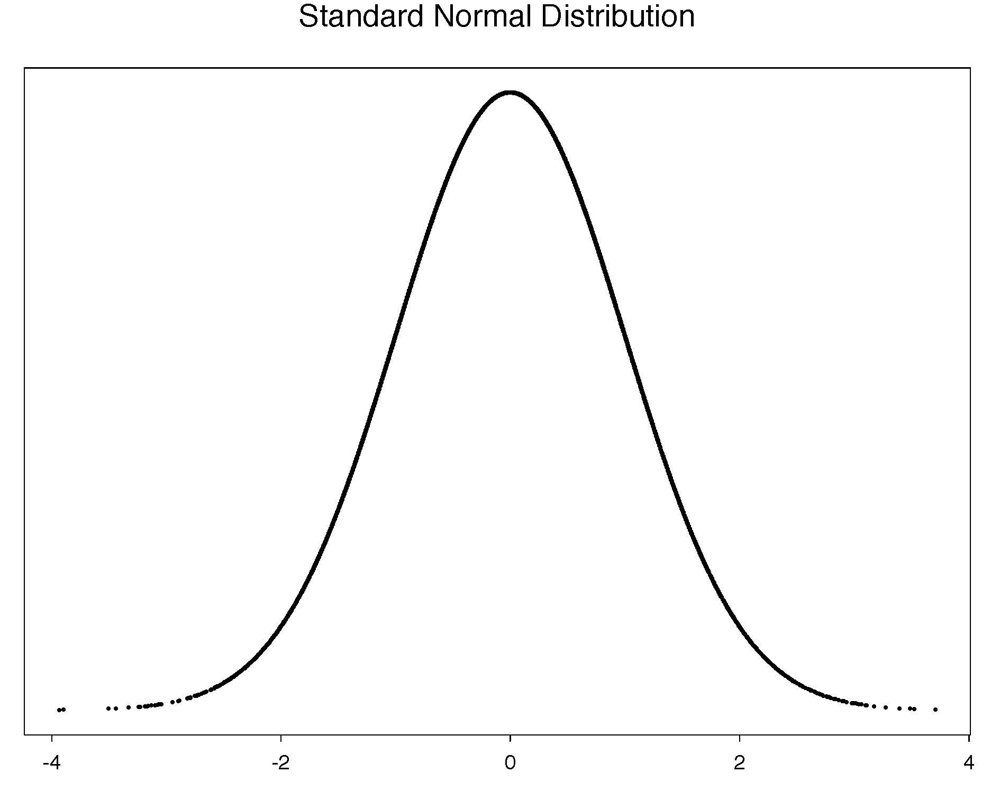
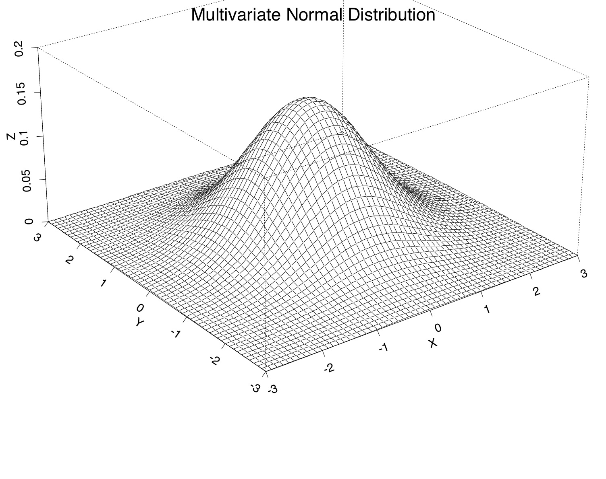
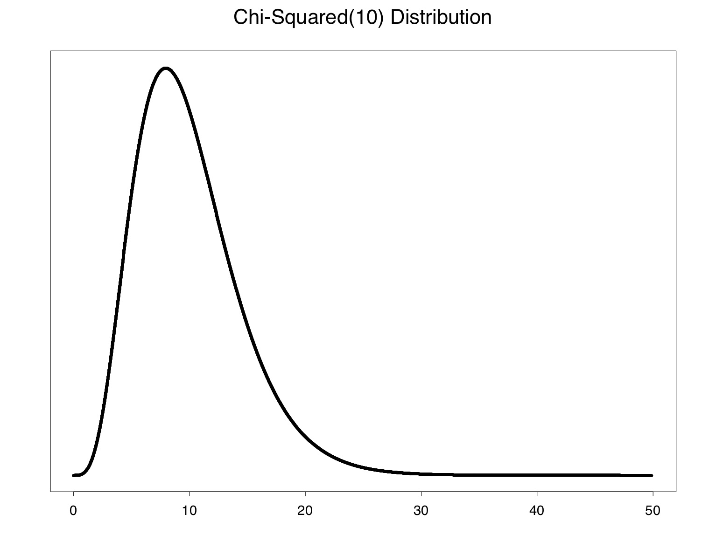
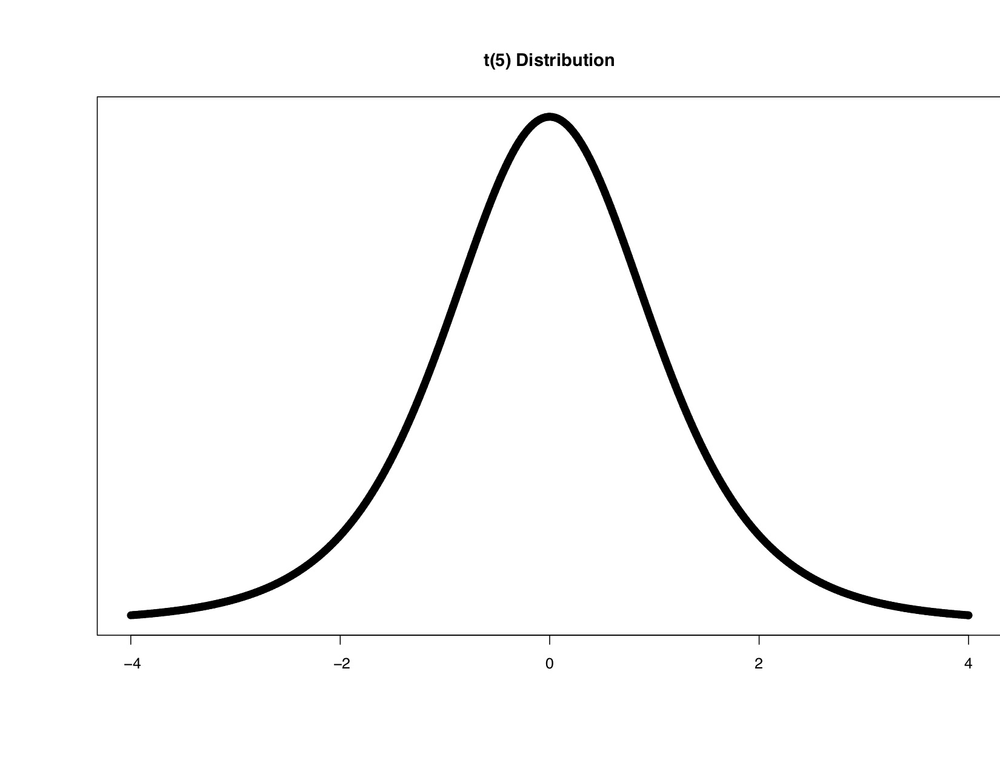
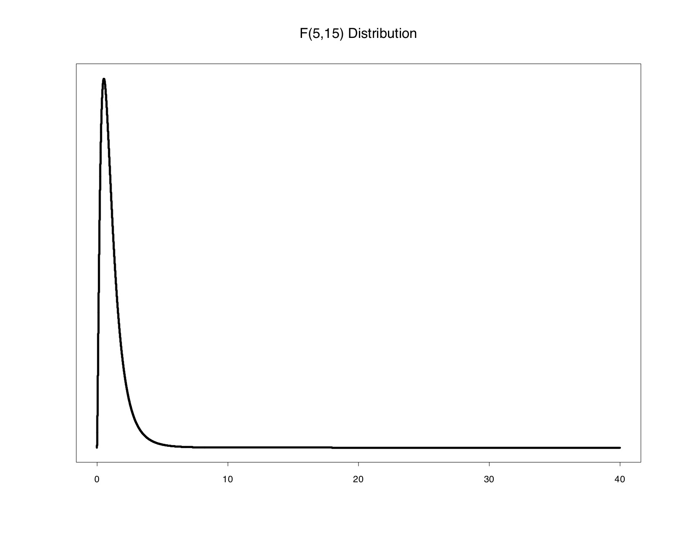

```{r setup, include=FALSE}
# R options
options(
  htmltools.dir.version = FALSE, # for blogdown
  show.signif.stars = FALSE,     # for regression output
  warm = 1
  )
# Set dpi and height for images
library(knitr)
knitr::opts_chunk$set(fig.height = 2.65, dpi = 300,fig.align='center',fig.show='hold',size='footnotesize', small.mar=TRUE) 
# For nonsese...
htmltools::tagList(rmarkdown::html_dependency_font_awesome())
```

```{r echo=FALSE, message=FALSE, warning=FALSE}
library(tidyverse)
library(rvest)
```


## Gaussian (normal) distribution

A random variable $X$ has a Gaussian (normal) distribution with mean $\mu$ and variance $\sigma^2$, written $X \sim N(\mu,\sigma^2)$, if $X$ has density

\begin{equation*}
f(x)=\frac{1}{\sqrt{2\pi}\sigma}\exp\left\{-\frac{1}{2 \sigma^2}(x-\mu)^2\right\}.
\end{equation*}

When $\mu=0$ and $\sigma=1$, then we say $X \sim N(0,1)$ has a *standard normal distribution*.  

If $X \sim N(\mu,\sigma^2)$, then $\frac{x-\mu}{\sigma} \sim N(0,1)$.  

For the standard normal distribution, 95% of the probability mass falls between -1.96 and 1.96 (roughly 2 standard deviations of the mean).  

Much of hypothesis testing is based on this fact.

The normal distribution is symmetric about its mean.


---
## Standard normal distribution

```{r echo=FALSE, out.height="500px",out.width="650px"}

```


---
## Multivariate Gaussian distribution

$\text{Suppose }X=(X_1,\ldots,X_n)'. X$ has an $n$ dimensional multivariate Gaussian (normal) distribution with $\text{mean } \mu \text{ and covariance } \Sigma, ~~ X \sim N_n(\mu,\Sigma)$,  if $X$ has density
\begin{equation*}
f(x)=\frac{1}{(2\pi)^{\frac{n}{2}} \mid \Sigma \mid^{\frac{1}{2}}} \exp\left\{-\frac{1}{2} (x-\mu)' \Sigma^{-1} (x-\mu)\right\}.
\end{equation*}


```{r echo=FALSE, out.height="400px",out.width="550px"}

```


---
## Helpful facts

  - A linear transformation of a multivariate normal distribution yields another multivariate normal distribution. 
  
  Suppose $X \sim N_n(\mu,\Sigma)$.  For $A_{r \times n}$, a matrix of constants and $b_{r \times 1}$, a vector of constants, then $Y=AX+b$ has the multivariate normal distribution given by $Y \sim N_r(A \mu+b,A \Sigma A')$.  
  
  - A linear combination of independent multivariate normal distributions is a multivariate normal distribution.  
  
  Suppose $X_1, \ldots, X_k$ are independent with $X_i \sim N_n(\mu_i,\Sigma_i)$, $i=1,\ldots,k$.  
  
  Suppose $a_1, \ldots, a_k$ are scalars and define $$Y=a_1 X_1 + \ldots + a_k X_k.$$ 
  
  Then $Y \sim N(\mu^*,\Sigma^*)$, where $\mu^*=\sum_{i=1}^k a_i \mu_i$ and $\Sigma^*=\sum_{i=1}^k a_i^2 \Sigma_i$.


---
## Helpful facts

- Partition $\boldsymbol{X} = (X_1,\ldots,X_n)'$ as
\begin{eqnarray*}
\boldsymbol{X} =
\begin{pmatrix}\boldsymbol{X}_1\\
\boldsymbol{X}_2
\end{pmatrix} & \sim & N_n\left[\left(\begin{array}{c}
\boldsymbol{\mu}_1\\
\boldsymbol{\mu}_2
\end{array}\right),\left(\begin{array}{cc}
\Sigma_{11} & \Sigma_{12} \\
\Sigma_{21} & \Sigma_{22}
\end{array}\right)\right],\\
\end{eqnarray*}

  where
  + $\boldsymbol{X}_1$ and $\boldsymbol{\mu}_1$ are $r \times 1$,
  + $\boldsymbol{X}_2$ and $\boldsymbol{\mu}_2$ are $(n-r) \times 1$,
  + $\Sigma_{11}$ is $r \times r$, and
  + $\Sigma_{22}$ is $(n-r) \times (n-r)$, with $\Sigma_{22} > 0$.
  
--

- Then,
$$\boldsymbol{X}_1 | \boldsymbol{X}_2 = \boldsymbol{x}_2 \sim N_r\left(\boldsymbol{\mu}_1 + \Sigma_{12}\Sigma_{22}^{-1}  (\boldsymbol{x}_2-\boldsymbol{\mu}_2), \Sigma_{11} - \Sigma_{12}\Sigma_{22}^{-1}\Sigma_{21}\right).$$

--

- Marginal distributions are also normal, that is,
$$\boldsymbol{X}_1  \sim N_r\left(\boldsymbol{\mu}_1, \Sigma_{11}\right); \ \ \ \boldsymbol{X}_2  \sim N_{n-r}\left(\boldsymbol{\mu}_2, \Sigma_{22}\right).$$


---
## Why do we care?

We often make assumptions in hierarchical models that certain quantities follow normal distributions -- these could be univariate or multivariate responses, random effects, or prior parameters. 

Sometimes we might assume certain quantities follow conditional normal distributions as well. 

Stay tuned for more details!


---
## Chi-squared distribution

A random variable $X$ has a central chi-squared distribution with $n$ degrees of freedom, written $X \sim \chi^2(n), \text{ if the density of } X$ is given by
\begin{equation*}
f(x)=\left(\frac{1}{\Gamma(\frac{n}{2})}\right) \left(\frac{1}{2}\right)^{\frac{n}{2}} x^{\frac{n}{2}-1} \exp\left\{-\frac{x}{2}\right\},
\end{equation*}
where $\Gamma(a)$ is the complete gamma function, given by $\Gamma(a)=\int_0^\infty x^{a-1} e^{-x} dx$.  

The chi-squared distribution is asymmetric and restricted to positive numbers.  

Its degrees of freedom determine the mean and variance of the distribution.


---
## Chi-squared distribution

```{r echo=FALSE, out.height="500px",out.width="650px"}

```


---
## Chi-squared distribution
The chi-squared distribution is related to the normal distribution.  

If the random variable $Z \sim N(0,1)$, then $Z^2 \sim \chi^2(1)$.  

In addition, if $Z_1, Z_2, \ldots, Z_n$ are independent, identically distributed $N(0,1)$ random variables, then $W=\sum_{i=1}^n Z_i^2$ has a chi-squared distribution with $n$ degrees of freedom; that is, $W \sim \chi^2(n)$.  

The mean of a $\chi^2(n)$ distribution is $n$, and its variance is $2n$.


---
## Why do we care?

The chi-squared distribution comes up a lot in testing using frequentist hierarchical and multilevel models, and mixtures of chi-squared distributions are important in testing variance components in frequentist multilevel models. 


---
## Student's t distribution

This distribution has a [great story](https://priceonomics.com/the-guinness-brewer-who-revolutionized-statistics/)!  


Suppose $X \sim N(0,1), Y \sim \chi^2(n) \text{ with } X \text{ and } Y$ independent.  The random variable
\begin{equation*}
T=\frac{X}{\sqrt{\frac{Y}{n}}}
\end{equation*}
has a $t$ distribution with $n$ degrees of freedom.  

We write this as $T \sim t(n)$. Like the standard normal, the t distribution is symmetric about 0.


---
## Student's t distribution

```{r echo=FALSE, out.height="500px",out.width="650px"}

```


---
## Student's t distribution


The degrees of freedom $n$ determines the amount of variability in the $t$ distribution.  

As the number of degrees of freedom increases, the variability of the $t$ distribution decreases.  

In fact, as the number of degrees of freedom gets large, the $t$ distribution approximates the standard normal distribution.  

With smaller degrees of freedom, the t distribution resembles a normal distribution with fatter tails.


A $t(1)$ distribution, which has 1 degree of freedom, is not well-behaved and is called a *Cauchy distribution*.


---
##  Why do we care?

Ahh, we see the t-distribution a lot -- it's a standard distribution in frequentist testing when we use 1 df tests in linear models and ANOVA.


---
## Fisher's F distribution

In case you're getting tired and feeling demoralized by this review of distributions, you might want to take a break and read about a [big mistake in Fisher's understanding](https://priceonomics.com/why-the-father-of-modern-statistics-didnt-believe/).  Even a brilliant scientist can make huge mistakes, so take heart!


---
## Fisher's F distribution

Suppose $X_1 \sim \chi^2(n_1) \text{ and } X_2 \sim \chi^2(n_2)$, and $X_1 \text{ and } X_2$ are independent.  The random variable 
\begin{equation*}
F=\frac{\left(\frac{X_1}{n_1}\right)}{\left(\frac{X_2}{n_2}\right)}
\end{equation*}
has a central $F$ distribution with $(n_1,n_2)$ degrees of freedom.  We write this $F \sim F(n_1,n_2)$.


---
## Fisher's F distribution

{width=45%}

We call $n_1$ the numerator degrees of freedom and $n_2$ the denominator degrees of freedom. If $T \sim t(\nu)$, then $T^2 \sim F_{1,\nu}$. The $F$ distribution is asymmetric and restricted to positive numbers.


---
## Why do we care?

The F distribution is the workhorse of testing hypotheses about the mean in linear models and ANOVA. 


---

class: center, middle

# What's next? 

### Move on to the readings for the next module!


