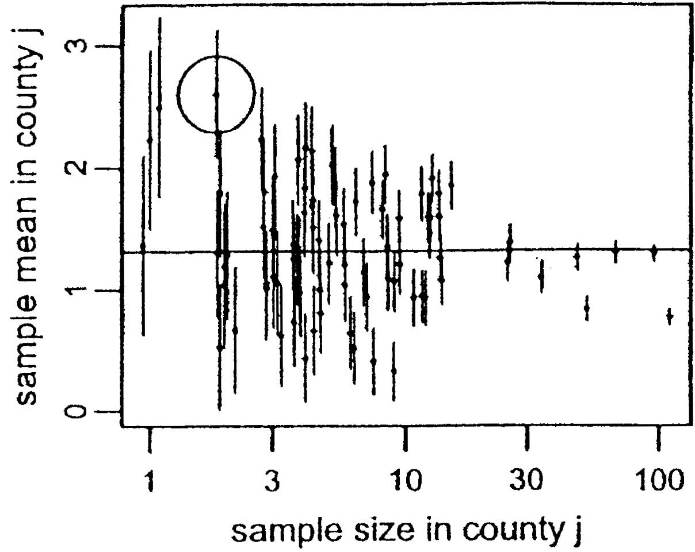
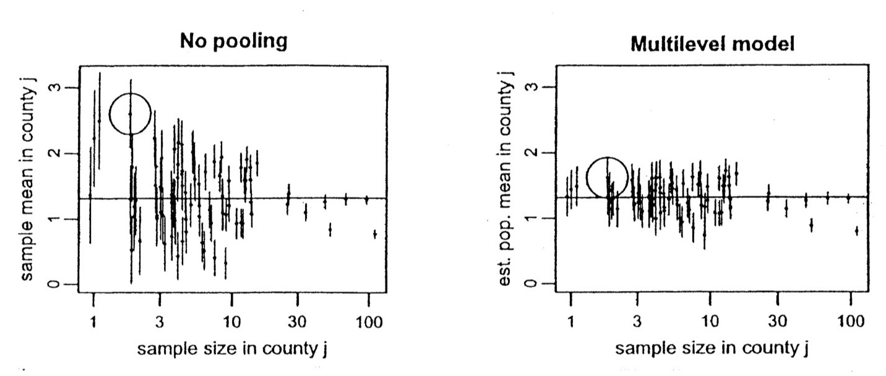

```{r setup, include=FALSE}
# R options
options(
  htmltools.dir.version = FALSE, # for blogdown
  show.signif.stars = FALSE,     # for regression output
  warm = 1
  )
# Set dpi and height for images
library(knitr)
knitr::opts_chunk$set(fig.height = 2.65, dpi = 300,fig.align='center',fig.show='hold',size='footnotesize', small.mar=TRUE) 
# For nonsese...
htmltools::tagList(rmarkdown::html_dependency_font_awesome())
```

```{r echo=FALSE, message=FALSE, warning=FALSE}
library(tidyverse)
library(rvest)
```


## Random effects ANOVA

.hlight[Random effects ANOVA] is a simple hierarchical model.

In this framework we assume that the group-specific means in the ANOVA model are distributed around some overall mean.

We will introduce this model in the context of a study in which the groups are the 85 counties in the state of Minnesota.

This example is from the Gelman and Hill book.

The full data includes data for more states but we will only focus on Minnesota just like the textbook.

The data is in the file `Radon.txt` on Sakai.


---
## Motivating example: radon study

The U.S. Environmental Protection Agency and the Surgeon General’s Office have estimated that as many as 20,000 lung cancer deaths are caused each year by exposure to radon (reference [here](https://www.radon.com/radon_facts/)). 

Radon is a cancer-causing radioactive gas (which occurs naturally as an indirect decay product of uranium) and is the second leading cause of lung cancer.

Unfortunately, you cannot see, smell or taste it. The most commonly used device for making short-term radon measurements in homes is the charcoal canister.

[Click here](http://www.ncradon.org/ncradon/) to check highest recorded radon levels in your area. Note that these levels may come from short-term home test kits, which vary widely in accuracy.

Given that counties are nested within states and some counties have very few observed data points, thinking about a hierarchical model here makes sense.


---
## Motivating example: radon study

Variable    | Description
:------------- | :------------
radon | radon levels for each house
log_radon | log(radon)
state | state
floor | lowest living area of each house: 0 for basement, 1 for first floor
countyname | county names
countyID | ID for the county names (1-85)
fips | state + county fips code
uranium | county-level soil uranium
log_uranium | log(uranium)

To ascertain that we need a multilevel model here, we should check for differences across counties during EDA. We return to this later.


---
## Radon study

We wish to estimate the distribution of radon levels in houses $i$ within the 85 counties $j$ in Minnesota. The outcome $y_i$ is radon (we will go with log_radon and show why later).

  - One estimate would be the average of all radon levels in Minnesota (same estimate for all counties), $\overline{y}$, but this ignores variation across counties, and some counties may have higher radon levels naturally than others (radon is more commonly found in soils with granite rock, as opposed to some other soil types).

  - Another estimate would be just to average the radon level in each county, $\overline{y}_j$, which can over-fit the data within county (for example, Lac Qui Parle County, which has the highest observed radon level of all the 85 MN counties, had radon measures from only 2 homes).
  
  This is similar to using a standard ANOVA model with a .hlight[fixed effect] for county (including county as a factor variable).


---
## Radon study

```{r echo=FALSE, out.height="400px",out.width="500px"}

```

*(figure from Gelman and Hill)*

Note we get pretty good (low variance) estimates in counties where more samples were taken, while our estimates are not great in counties where just a few samples were obtained. 


---
## Radon study

A common procedure for obtaining estimates of group means $\mu_j$ might be via ANOVA model
$$y_{ij}=\mu+\alpha_j+\varepsilon_{ij},$$
where $\varepsilon_{ij} \sim N(0,\sigma^2)$, testing the significance of the groups using an overall F-test.

  - If $p<0.05$, use the estimate $\widehat{\mu}_j=\overline{y}_j$ for the mean in each county
  - If $p>0.05$, use the estimate $\widehat{\mu}_j=\overline{y}$ for the mean in each county
  
With either case, we will be using sub-optimal estimates for some counties, and the above method is fairly extreme (all or nothing one way or the other!).


---
## Radon study

An improvement might be using the estimate $\overline{y}_j$ for counties with sufficient sample size and the estimate $\overline{y}$ for counties where the variability is too high.  

Important question: how do we define "sufficient" and "too high"?

.hlight[Random effects] ANOVA is a special case of a .hlight[hierarchical] or .hlight[multilevel] linear model that provides a nice framework for borrowing information across groups when needed to stabilize estimates.  


---
## Random effects ANOVA

We can specify such a model as
$$y_{ij}=\mu+\alpha_j+\varepsilon_{ij},$$
where $\varepsilon_{ij} \overset{iid}{\sim} N(0,\sigma^2)$ and $\alpha_j \overset{iid}{\sim} N(0,\tau^2)$. 

The model on $\alpha_j$ allows us to borrow information in order to obtain better group-specific estimates when needed; because $\alpha_j$ is now viewed as random, the model can be called a .hlight[random effects] model. 

This particular model is sometimes called a .hlight[random intercept] model because each group has its own intercept, $\mu_j=\mu+\alpha_j$, that follows a Gaussian distribution.


---
## Random effects ANOVA for radon data

```{r echo=FALSE, out.height="450px",out.width="680px"}

```

The circled data point had the highest estimated mean radon level in fixed effects ANOVA.


---
## Radon study

The multilevel estimates in the previous slide represent a compromise between the two extremes.

In this simple setting (with no predictors), the multilevel estimate for county $j$ can be approximated as a weighted average of the mean of all observations in the county, weighting both the unpooled estimate $\overline{y}_j$ and the mean over all counties $\overline{y}$.


---
## Radon study

How does random effects ANOVA borrow information?

The multilevel estimate

$$\widehat{\mu}_j \approx
\frac{\frac{n_j}{\sigma^2}\overline{y}_j+\frac{1}{\tau^2}\overline{y}}{\frac{n_j}{\sigma^2}+\frac{1}{\tau^2}},$$
   
where 
    
- $n_j$ is the number of homes measured in county $j$

- $\sigma^2$ is the within-county variance in the log radon
  measurements
  
- $\tau^2$ is the variance across the average log radon
  levels of different counties


---
## Radon study

The weighted average reflects the relative amount of information available on each individual county, compared to that available across all counties.

- Averages from counties with smaller sample sizes are less precise, so the weighting shrinks the multilevel estimates closer to the overall state average.  For example, if $n_j=0,$ the multilevel estimate is just $\overline{y}$.

- Averages from counties with larger sample sizes are more precise, and the multilevel estimates are closer to the county averages.  As $n_j \rightarrow \infty$, the multilevel estimate is just the county average $\overline{y}_j$.

- In intermediate cases, the multilevel estimate is in between the
  extremes.
  
In practice, we carry out all estimation together (estimate variances along with the mean parameters), but we won't worry about this yet.

These estimates are often called .hlight[shrinkage estimates], as they "shrink" the no pooling estimates back towards the complete pooling mean, to an extent determined by the information in the data.


---
## Random intercept model

This model is a special case of a *random intercept* model in which covariates are categorical.

Note some consequences of this model:
$$y_{ij}=\mu+\alpha_j+\varepsilon_{ij},$$
where $\varepsilon_{ij} \overset{iid}{\sim} N(0,\sigma^2)$ $\perp$ $\alpha_j \overset{iid}{\sim} N(0,\tau^2)$

$E[y_{ij}]=E[\mu+\alpha_j+\varepsilon_{ij}]=\mu+0+0=\mu$
\begin{eqnarray*}
\text{Var}[y_{ij}]&=&E[(y_{ij}-E(y_{ij}))^2] \\
&=& E[(\mu+\alpha_j+\varepsilon_{ij}-\mu)^2] \\
&=& E[(\alpha_j+\varepsilon_{ij})^2] \\
&=& E[\alpha_j^2+2\alpha_j\varepsilon_{ij}+\varepsilon_{ij}^2] \\
&=& \tau^2+0+\sigma^2=\sigma^2+\tau^2
\end{eqnarray*}


---
## Random intercept model
For two observations $i$ and $i'$ in different groups $j$ and $j'$ respectively,
\begin{eqnarray*}
\text{Cov}(y_{ij},y_{i'j'})&=& E[(y_{ij}-E(y_{ij}))(y_{i'j'}-E(y_{i'j'}))] \\
&=& E[(\alpha_j+\epsilon_{ij}) (\alpha_{j'}+\epsilon_{i'j'})] \\
&=& E[\alpha_j\alpha_{j'}] + E[\epsilon_{ij}\alpha_{j'}] + E[\alpha_{j}\epsilon_{i'j'}] + E[\epsilon_{ij}\epsilon_{i'j'}] = 0
\end{eqnarray*}


For two observations $i$ and $i'$ in the same group $j$,
\begin{eqnarray*}
\text{Cov}(y_{ij},y_{i'j})&=& E[(y_{ij}-E(y_{ij}))(y_{i'j}-E(y_{i'j}))] \\
&=& E[(\alpha_j+\epsilon_{ij}) (\alpha_{j}+\epsilon_{i'j})] \\
&=& E[\alpha_j\alpha_{j}] + E[\epsilon_{ij}\alpha_{j}] + E[\alpha_{j}\epsilon_{i'j}] + E[\epsilon_{ij}\epsilon_{i'j}] \\
&=& E[\alpha_j^2] + 0 + 0 + 0 \\
&=& V[\alpha_j] =\tau^2
\end{eqnarray*}

It is then relatively easy to write down the covariance matrix for the response vector.


---
## Intraclass correlation

The correlation between two observations in the same group is then given by

\begin{eqnarray*}
\text{Corr}(y_{ij},y_{i'j})&=&\frac{\text{Cov}(y_{ij},y_{i'j})}{\sqrt{\text{Var}(y_{ij})\text{Var}(y_{i'j})}} \\
&=& \frac{\tau^2}{\sigma^2+\tau^2}
\end{eqnarray*}

This motivates the use of random effects ANOVA to handle cases in which we expect subgroups of observations to be correlated (e.g., repeated measures or family studies).


---
## Covariance matrix (special case)

For simplicity, assume $n_j=n$ and the total sample size $N=nJ$.

Suppose $Y$ is the response vector. That is, with the responses stacked, one group at a time.

Then we can also write  
\begin{equation*}
\text{Cov}(Y) = \sigma^2I_{N\times N} + \tau^2
\begin{pmatrix} J_n & 0 & \cdots & 0 \\
0 & J_n & \cdots & 0 \\
\vdots & \vdots & \vdots & \vdots \\
0 & 0 & \cdots & J_n \\
\end{pmatrix}\\ = I_J \otimes V,
\end{equation*}
where $V=\sigma^2I_n+\tau^2J_n$ and $J_n$ is an $n \times n$ matrix of 1's.


---
## Kronecker product review

The *Kronecker product* is a convenient way to express patterned covariance matrices (among other things).

For matrices $A_{m \times n}$ and $B_{p \times q}$, the *Kronecker product*
$$A \otimes B=\begin{bmatrix}a_{11}B & \cdots & a_{1n}B \\ \vdots & \ddots & \vdots \\ a_{m1}B & \cdots & a_{mn}B \end{bmatrix}.$$

Using a Kronecker product, we can succinctly express the block diagonal covariance matrix of all our observations when we have equal numbers of observations in each group.


---
## Looking ahead

Many of the models we will look at are special cases of general linear mixed effects models.

We will cover this in more detail later but the general notation is $$Y=X\beta+Zb+\varepsilon.$$

In the random effects ANOVA case,
  - $X$ is just a column of 1's specifying the intercept $\beta=\mu$.
  
  - $Z$ is a matrix of indicator variables indicating group membership.
  
  - The vector of random effects $b \sim N(0,G)$, where $G=\tau^2I$.
  
  - Finally, $\varepsilon \sim N(0,R)$ where $R=\sigma^2I$.


---
## Looking ahead

The covariance matrix is then given by 
\begin{eqnarray*}
\text{Var}(Y) &=& \text{Var}(X\beta+Zb+\varepsilon) \\
&=& \text{Var}(X\beta)+\text{Var}(Zb)+\text{Var}(\varepsilon)  \\
&=& Z\text{Var}(b)Z' + \text{Var}(\varepsilon)\\
&=& ZGZ'+R \\
&=& Z(\tau^2I)Z'+R \\
&=& \tau^2ZZ'+\sigma^2I.
\end{eqnarray*}
  


---

class: center, middle

# What's next? 

### Move on to the readings for the next module!


