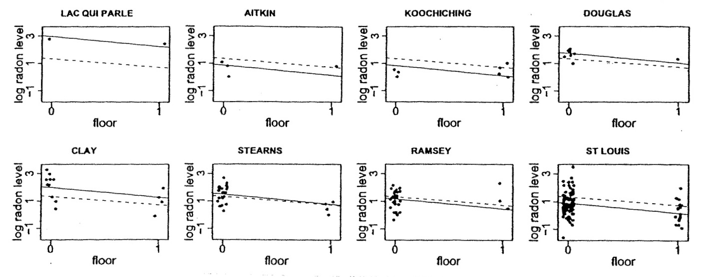

```{r setup, include=FALSE}
# R options
options(
  htmltools.dir.version = FALSE, # for blogdown
  show.signif.stars = FALSE,     # for regression output
  warm = 1
  )
# Set dpi and height for images
library(knitr)
knitr::opts_chunk$set(fig.height = 2.65, dpi = 300,fig.align='center',fig.show='hold',size='footnotesize', small.mar=TRUE) 
# For nonsese...
htmltools::tagList(rmarkdown::html_dependency_font_awesome())
```


```{r echo=FALSE, message=FALSE, warning=FALSE}
library(tidyverse)
library(rvest)
library(kableExtra)
library(lattice)
library(dplyr)
library(ggplot2)
library(lme4)
```


## Radon study

.hlight[Recall]: we want to estimate the distribution of radon levels in houses $i$ within the 85 counties $j$.

There are 919 total observations in the data. The data is in the file `Radon.txt` on Sakai.

Variable    | Description
:------------- | :------------
radon | radon levels for each house
log_radon | log(radon)
state | state
floor | lowest living area of each house: 0 for basement, 1 for first floor
countyname | county names
countyID | ID for the county names (1-85)
fips | state + county fips code
uranium | county-level soil uranium
log_uranium | log(uranium)


---
## Radon study

.large[
```{r fig.height=4,message=F}
Radon <- read.csv("data/Radon.txt", header = T,sep="")
Radon$floor <- factor(Radon$floor,levels=c(0,1),labels=c("Basement","First Floor"))
str(Radon)
```
]


---
## Radon study

.large[
```{r fig.height=4,message=F}
head(Radon)
summary(Radon[,-c(2,7)])
```
]


---
## Radon study

.midsmall[
```{r message=F}
table(Radon$countyname) #we don't have enough data in some counties, so we should look to borrow information across counties.
```
]


---
## Radon study

The raw radon levels can only take on positive values.

```{r fig.height=3,message=F}
ggplot(Radon,aes(radon)) +
  geom_histogram(aes(y=..density..),color="black",linetype="dashed",
                 fill=rainbow(15),bins=15) + theme(legend.position="none") +
  geom_density(alpha=.25, fill="lightblue") + scale_fill_brewer(palette="Blues") +
  labs(title="Distribution of Radon Levels",y="Radon") + theme_classic() 
```

--
.block[Obviously very skewed.]


---
## Radon study

Let's look at `log_radon` instead.

```{r fig.height=3,message=F}
ggplot(Radon,aes(log_radon)) +
  geom_histogram(aes(y=..density..),color="black",linetype="dashed",
                 fill=rainbow(15),bins=15) + theme(legend.position="none") +
  geom_density(alpha=.25, fill="lightblue") + scale_fill_brewer(palette="Blues") +
  labs(title="Distribution of Log Radon Levels",y="Log Radon") + theme_classic() 
```

--

.block[Much better! Let's go with log radon for now.]


---
## Radon study

Are there any variations of radon levels by county? There are too many counties, so, let's do it for a random sample of counties.
```{r fig.height=3.5,message=F,eval=F}
set.seed(1000)
sample_county <- sample(unique(Radon$countyname),25,replace=F)
ggplot(Radon[is.element(Radon$countyname,sample_county),],
       aes(x=countyname, y=log_radon, fill=countyname)) +
  geom_boxplot() +
  labs(title="Log radon levels by county",
       x="County",y="Log Radon") + theme_classic() + 
  theme(legend.position="none",axis.text.x = element_text(angle = 90))
```


---
## Radon study

```{r fig.height=4.5,message=F,echo=F}
set.seed(1000)
sample_county <- sample(unique(Radon$countyname),30,replace=F)
ggplot(Radon[is.element(Radon$countyname,sample_county),],
       aes(x=countyname, y=log_radon, fill=countyname)) +
  geom_boxplot() +
  labs(title="Log radon levels by county",
       x="County",y="Log Radon") + theme_classic() + 
  theme(legend.position="none",axis.text.x = element_text(angle = 90))
```

--

.block[Looks like the levels vary by county. However, there are many counties with very little data.]


---
## Radon study

Let's focus on counties with at least 11 houses.

```{r fig.height=3.2,message=F,eval=F}
sample_county <- which(table(Radon$countyID) > 10)
ggplot(Radon[is.element(Radon$countyID,sample_county),],
       aes(x=countyname, y=log_radon, fill=countyname)) +
  geom_boxplot() +
  labs(title="Log radon levels by county",
       x="County",y="Log Radon") + theme_classic() + 
  theme(legend.position="none",axis.text.x = element_text(angle = 90))
```


---
## Radon study

```{r fig.height=4.5,message=F,echo=F}
sample_county <- which(table(Radon$countyID) > 10)
ggplot(Radon[is.element(Radon$countyID,sample_county),],
       aes(x=countyname, y=log_radon, fill=countyname)) +
  geom_boxplot() +
  labs(title="Log radon levels by county",
       x="County",y="Log Radon") + theme_classic() + 
  theme(legend.position="none",axis.text.x = element_text(angle = 90))
```

<div class="question">
What can you conclude from this plot?
</div>


---
## Radon study in R

We start with a random effects ANOVA model. We can fit that model in R by doing
```{r fig.height=3.2,message=F}
Model1 <- lmer(log_radon ~ (1 | countyname), data = Radon) 
summary(Model1)
```


---
## Radon study in R

.midsmall[
```{r fig.height=3.2,message=F}
coef(Model1)
```
]


---
## Plotting code

.small[
```{r fig.height=5.3,message=F,eval=FALSE}
y <- Radon$log_radon; ybarbar <- mean(y)
J <- length(unique(Radon$countyname))
sample_size <- as.vector(table(Radon$countyname))
sample_size_jittered <- sample_size*exp(runif(J, -.1, .1))

cty_mns <- tapply(y,Radon$countyname,mean)
cty_vars <- tapply(y,Radon$countyname,var)
cty_sds <- mean(sqrt(cty_vars[!is.na(cty_vars)]))/sqrt(sample_size)
cty_sds_sep <- sqrt(tapply(y,Radon$countyname,var)/sample_size)


par(mfrow=c(1,2))
plot (sample_size_jittered, cty_mns, cex.lab=.9, cex.axis=1,
      xlab="sample size in county j",
      ylab="avg. log radon in county j",
      pch=20, log="x", cex=.3, mgp=c(1.5,.5,0),
      ylim=c(0,3.2), yaxt="n", xaxt="n")
axis (1, c(1,3,10,30,100), cex.axis=.9, mgp=c(1.5,.5,0))
axis (2, seq(0,3), cex.axis=.9, mgp=c(1.5,.5,0))
for (j in 1:J){
  lines (rep(sample_size_jittered[j],2),
         cty_mns[j] + c(-1,1)*cty_sds[j], lwd=.5)
#         cty_mns[j] + c(-1,1)*mean(cty_sds[!is.na(cty_sds)]), lwd=.5)
}
title("No pooling",cex.main=.9, line=1)
abline(h=ybarbar)


library(arm)
plot (sample_size_jittered, coef(Model1)$countyname[,1], cex.lab=.9, cex.axis=1,
      xlab="sample size in county j",
      ylab="avg. log radon in county j",
      pch=20, log="x", cex=.3, mgp=c(1.5,.5,0),
      ylim=c(0,3.2), yaxt="n", xaxt="n")
axis (1, c(1,3,10,30,100), cex.axis=.9, mgp=c(1.5,.5,0))
axis (2, seq(0,3), cex.axis=.9, mgp=c(1.5,.5,0))
for (j in 1:J){
  lines (rep(sample_size_jittered[j],2),coef(Model1)$countyname[j,1] + c(-1,1)*se.ranef(Model1)$countyname[j,1], lwd=.5)
} 
title("Partial Pooling",cex.main=.9, line=1)
abline(h=ybarbar)
```
]


---
## Plots

```{r fig.height=5.3,message=F, echo=F}
y <- Radon$log_radon; ybarbar <- mean(y)
J <- length(unique(Radon$countyname))
sample_size <- as.vector(table(Radon$countyname))
sample_size_jittered <- sample_size*exp(runif(J, -.1, .1))

cty_mns <- tapply(y,Radon$countyname,mean)
cty_vars <- tapply(y,Radon$countyname,var)
cty_sds <- mean(sqrt(cty_vars[!is.na(cty_vars)]))/sqrt(sample_size)
cty_sds_sep <- sqrt(tapply(y,Radon$countyname,var)/sample_size)


par(mfrow=c(1,2))
plot (sample_size_jittered, cty_mns, cex.lab=.9, cex.axis=1,
      xlab="sample size in county j",
      ylab="avg. log radon in county j",
      pch=20, log="x", cex=.3, mgp=c(1.5,.5,0),
      ylim=c(0,3.2), yaxt="n", xaxt="n")
axis (1, c(1,3,10,30,100), cex.axis=.9, mgp=c(1.5,.5,0))
axis (2, seq(0,3), cex.axis=.9, mgp=c(1.5,.5,0))
for (j in 1:J){
  lines (rep(sample_size_jittered[j],2),
         cty_mns[j] + c(-1,1)*cty_sds[j], lwd=.5)
#         cty_mns[j] + c(-1,1)*mean(cty_sds[!is.na(cty_sds)]), lwd=.5)
}
title("No pooling",cex.main=.9, line=1)
abline(h=ybarbar)


library(arm)
plot (sample_size_jittered, coef(Model1)$countyname[,1], cex.lab=.9, cex.axis=1,
      xlab="sample size in county j",
      ylab="avg. log radon in county j",
      pch=20, log="x", cex=.3, mgp=c(1.5,.5,0),
      ylim=c(0,3.2), yaxt="n", xaxt="n")
axis (1, c(1,3,10,30,100), cex.axis=.9, mgp=c(1.5,.5,0))
axis (2, seq(0,3), cex.axis=.9, mgp=c(1.5,.5,0))
for (j in 1:J){
  lines (rep(sample_size_jittered[j],2),coef(Model1)$countyname[j,1] + c(-1,1)*se.ranef(Model1)$countyname[j,1], lwd=.5)
} 
title("Partial Pooling",cex.main=.9, line=1)
abline(h=ybarbar)
```


---
## Random effects model plus a grouping factor

One important predictor of radon levels is the floor on which the measurement is taken:  basement or first floor.

Radon comes from underground and can enter more easily when the house is built into the ground.

In addition, basements tend to have higher levels than ground floors.

So, let's explore the relationship between `log_radon` and `floor`.

Note that is an individual-level (different observation for each house) variable, unlike the `uranium` variable, which is county-level (group-level).

We will return to this point later.


---
## Radon study

```{r fig.height=3,message=F}
ggplot(Radon,aes(x=floor, y=log_radon, fill=floor)) +
  geom_boxplot() + scale_fill_brewer(palette="Greens") +
  labs(title="Log radon vs floor", x="Lowest living area of each house",y="Log Radon") + 
  theme_classic() + theme(legend.position="none")
```

--

.block[Looks like radon levels are indeed higher for houses with the basement as the lowest living area.]

---
## Radon study

Let's look at the same relationship for a random sample of counties.

```{r fig.height=3.5,message=F,eval=F}
sample_county <- sample(unique(Radon$countyname),8,replace=F)
ggplot(Radon[is.element(Radon$countyname,sample_county),],
       aes(x=floor, y=log_radon, fill=floor)) +
  geom_boxplot() +
  scale_fill_brewer(palette="Greens") +
  labs(title="Log radon vs floor by county",
       x="Lowest living area of each house",y="Log Radon") + 
  theme_classic() + theme(legend.position="none") +
  facet_wrap( ~ countyname,ncol=4)
```


---
## Radon study

```{r fig.height=4.5,message=F,echo=F}
sample_county <- sample(unique(Radon$countyname),8,replace=F)
ggplot(Radon[is.element(Radon$countyname,sample_county),],
       aes(x=floor, y=log_radon, fill=floor)) +
  geom_boxplot() +
  scale_fill_brewer(palette="Greens") +
  labs(title="Log radon vs floor by county",
       x="Lowest living area of each house",y="Log Radon") + 
  theme_classic() + theme(legend.position="none") +
  facet_wrap( ~ countyname,ncol=4)
```

Again, not enough data for some counties.


---
## Radon study

Let's focus on counties with at least 16 houses.

```{r fig.height=3.2,message=F,eval=F}
sample_county <- which(table(Radon$countyID) > 15)
ggplot(Radon[is.element(Radon$countyID,sample_county),],
       aes(x=floor, y=log_radon, fill=floor)) +
  geom_boxplot() +
  scale_fill_brewer(palette="Greens") +
  labs(title="Log radon vs floor by county",
       x="Lowest living area of each house",y="Log Radon") + 
  theme_classic() + theme(legend.position="none") +
  facet_wrap( ~ countyname,ncol=4)
```


---
## Radon study

```{r fig.height=4.3,message=F,echo=F}
sample_county <- which(table(Radon$countyID) > 15)
ggplot(Radon[is.element(Radon$countyID,sample_county),],
       aes(x=floor, y=log_radon, fill=floor)) +
  geom_boxplot() +
  scale_fill_brewer(palette="Greens") +
  labs(title="Log radon vs floor by county",
       x="Lowest living area of each house",y="Log Radon") + 
  theme_classic() + theme(legend.position="none") +
  facet_wrap( ~ countyname,ncol=4)
```

--

.block[Even though the overall direction is the same, it looks like the actual differences between floor = 0 and floor = 1 differs for some counties.]


---
## Radon study

As we have been doing, let's begin by examining the complete-pooling regression,
$$y_{ij}=\alpha+\beta x_{ij} + \varepsilon_{ij}; \ \ \ \varepsilon_{ij} \sim N(0,\sigma^2)$$

and the no-pooling regression
$$y_{ij}=\alpha_{j}+\beta x_{ij} + \varepsilon_{ij}; \ \ \ \varepsilon_{ij} \sim N(0,\sigma^2)$$

where $\alpha_{j}$ is the mean log radon level from basement measures of homes (indexed by i) in county $j$. 

The following plot shows the dashed lines $\widehat{y}=\widehat{\alpha}+\widehat{\beta} x$ for eight selected counties from the complete pooling model, and the solid lines $\widehat{y}=\widehat{\alpha}_j+\widehat{\beta}x$ from no pooling model.


---
## Radon study

```{r echo=FALSE, out.height="500px",out.width="600px"}

```


---
## Radon study

The estimates of $\beta$ (the association between floor of home and radon level) differ slightly for the two regressions, with $\widehat{\beta}=-0.61$ for the pooling model, and $\widehat{\beta}=-0.72$ for the no-pooling model. 

As we might expect, we tend to have higher radon levels in the basement $(p < 0.0001)$.  

As expected, neither analysis is perfect.  

The complete-pooling analysis ignores variation in radon levels between counties, which is undesirable because our goal is to identify counties with high-radon homes -- we can't pool away the main research question!

The no-pooling analysis is also problematic -- for example the Lac Qui Parle County line is estimated based on just two data points.


---
## Radon study

So we turn to a simple multilevel model instead:
$$y_{ij}=\gamma_0 + \alpha_{j}+\beta x_{ij} + \varepsilon_{ij},$$

where now $\alpha_{j} \sim N(0,\tau^2)$ and $\varepsilon_{ij} \sim N(0, \sigma^2)$.

This model can also be parameterized as
$$y_{ij} \sim N(\alpha_{j}+\beta x_{ij}, \sigma^2),$$

with each
$$\alpha_j \sim N\left(\gamma_0,\tau^2 \right).$$ 


---
## Radon study in R

First, the pooled model
```{r fig.height=3.2,message=F}
###pooled model
lm_pooled <- lm(log_radon ~ floor, data = Radon)
summary(lm_pooled)
```


---
## Radon study in R

Next, the unpooled model.
```{r fig.height=3.2,message=F}
###unpooled  model
lm_unpooled <- lm(log_radon ~ floor + countyname, data = Radon)
summary(lm_unpooled)
```


---
## Radon study in R

Finally, the random intercepts model with a fixed effect for floor.
```{r fig.height=3.2,message=F}
Model2 <- lmer(log_radon ~ floor + (1 | countyname), data = Radon) 
summary(Model2)
```


---
## Radon study in R

.midsmall[
```{r fig.height=3.2,message=F}
coef(Model2)
```
]


---
## Interpretation of fixed effects

- Intuitively, we have an overall "average" regression line for all houses across all counties in Minnesota which has slope -0.69 and intercept 1.46.

--

- That is, the general estimated line for any of the houses in Minnesota is: 
.block[
.small[
$$\widehat{\text{log(radon)}}_{ij} = 1.46 - 0.69 \times \textrm{floor}_{ij}$$
]
]

- For .hlight[any house in Minnesota with a basement as the lowest living area, the baseline radon level is] $e^{1.46} = 4.31$.

--

- Then, for any house in Minnesota, .hlight[having a first floor as the lowest living area, instead of a basement], reduces the radon level by a multiplicative effect of $e^{-0.69} \approx 0.5016$, that is, about a 49.84% reduction.

--

- However, if the house is in Dakota county for example, we also need to add on the random intercept for that county.


---
## Interpretation of fixed effects

- For Dakota county, we have
  ```{r fig.height=3.2,message=F}
(ranef(Model2)$countyname)["DAKOTA",]
```

  so that the estimated regression line for Dakota county is approximately
.block[
.small[
$$\widehat{\text{log(radon)}}_{ij} = (1.46 - 0.12) + 0.69 \times \textrm{floor}_{ij} = 1.35 - 0.69 \times \textrm{floor}_{ij}$$
]
]

--

- Thus, for any house in Dakota county in Minnesota with a basement as the lowest living area, the baseline radon level is actually $e^{1.34} \approx 3.82$, which is .hlight[lower than the overall state wide average].

--

- For floor effect remains the same, at least until we explore random slopes.


---
## Radon study in R

Again,
```{r fig.height=3.2,message=F}
summary(Model2)
```


---
## Interpretation of random effects

- The estimated standard error $\hat{\sigma} = 0.76$ describes the within-county or remaining unexplained variation.

--

- The estimated $\hat{\tau} = 0.33$ describes the across-county variation attributed to the random intercept.

--

- The correlation between two houses in the same county is then given by
$$\widehat{\text{Corr}(y_{ij},y_{i'j})} = \frac{\hat{\tau}^2}{\hat{\sigma}^2+\hat{\tau}^2} = \frac{0.1077}{0.5709 + 0.1077} \approx 0.16.$$

--

- We do have some correlation, but not that strong.

--

- You can visualize the random effects by typing `dotplot(ranef(Model2, condVar=TRUE))$countyname` in R.

--

- So many counties! So, you will need to zoom out on your computer.


---
## Interpretation of random effects

```{r fig.height=5.3,message=F,echo=F}
dotplot(ranef(Model2, condVar=TRUE))$countyname
```


---

class: center, middle

# What's next?

### Move on to the readings for the next module!


