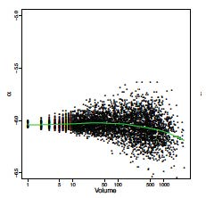

```{r setup, include=FALSE}
# R options
options(
  htmltools.dir.version = FALSE, # for blogdown
  show.signif.stars = FALSE,     # for regression output
  warm = 1
  )
# Set dpi and height for images
library(knitr)
knitr::opts_chunk$set(fig.height = 2.65, dpi = 300,fig.align='center',fig.show='hold',size='footnotesize', small.mar=TRUE) 
# For nonsese...
htmltools::tagList(rmarkdown::html_dependency_font_awesome())
```

```{r echo=FALSE, message=FALSE, warning=FALSE}
library(rvest)
library(rstan)
library(brms)
library(tidyverse)
library(tidybayes)
library(lme4)
```


## Bayesian random effects ANOVA model

- Recall our hierarchical model can be written as
.block[
.small[
$$
\begin{split}
y_{ij} | \mu_j, \sigma^2 & \sim \mathcal{N} \left( \mu_j, \sigma^2\right); \ \ \ i = 1,\ldots, n_j\\
\mu_j | \mu, \tau^2 & \sim \mathcal{N} \left( \mu, \tau^2 \right); \ \ \ j = 1, \ldots, J,
\end{split}
$$
]
]

  with priors
.block[
.small[
$$
\begin{split}
\pi(\mu) & = \mathcal{N}\left(\mu_0, \gamma^2_0\right)\\
\pi(\tau^2) & = \mathcal{IG} \left(\dfrac{\eta_0}{2}, \dfrac{\eta_0\tau_0^2}{2}\right)\\
\pi(\sigma^2) & = \mathcal{IG} \left(\dfrac{\nu_0}{2}, \dfrac{\nu_0\sigma_0^2}{2}\right).\\
\end{split}
$$
]
]

--

- We can write our own Gibbs sampler for this model (see end of this module and also, next homework). 

--

- However, since we will rely primarily on the .hlight[brms] package for fitting many of our hierarchical models anyway, let's see if we can fit a version of this model to the radon data, using the .hlight[brms] package.


---
## Radon study again

```{r fig.height=4,message=F, echo=F}
Radon <- read.csv("data/Radon.txt", header = T,sep="")
Radon$floor <- factor(Radon$floor,levels=c(0,1),labels=c("Basement","First Floor"))
```

```{r eval=FALSE, warning=FALSE, message=FALSE, cache=TRUE}
#library(rstan)
#library(brms)
#library(tidybayes)
rstan_options(auto_write = TRUE)
options(mc.cores = parallel::detectCores())

#note: there are many ways of specifying priors in brms
#we will touch on some other options soon
#see the help page for "set_priors"
#for now, vague priors under our model specification will do
prior <- c(set_prior("normal(0,5)", class = "Intercept"),
           #set_prior("normal(0,10)", class = "b"),
           set_prior("inv_gamma(0.5,5)", class = "sigma"),
           set_prior("inv_gamma(0.5,5)", class = "sd"))

m1 <- brm(log_radon ~ (1 | countyname),
          data = Radon, family = gaussian(),
          prior = prior,iter = 3000, warmup = 2000,seed = 13)

summary(m1)
```


---
## Radon study again

```{r echo=FALSE, warning=FALSE, message=FALSE, cache=TRUE}
#library(rstan)
rstan_options(auto_write = TRUE)
options(mc.cores = parallel::detectCores())

#vague priors
prior <- c(set_prior("normal(0,5)", class = "Intercept"),
           #set_prior("normal(0,10)", class="b"),
           set_prior("inv_gamma(0.5,5)", class="sigma"),
           set_prior("inv_gamma(0.5,5)", class="sd"))

m1 <- brm(log_radon ~ (1 | countyname),
          data = Radon, family = gaussian(),
          prior = prior,iter = 5000, warmup = 2000,seed = 13)

summary(m1)
```


---
## Radon study again

We can compare the results to the frequentist estimates.
```{r fig.height=3.2,message=F}
Model1 <- lmer(log_radon ~ (1 | countyname), data = Radon) 
summary(Model1)
```


---
## Radon study again

Quick diagnostics for the Bayesian model.
```{r warning=FALSE, message=FALSE, cache=TRUE, fig.height=3.9}
plot(m1)
```


---
## Radon study again

We can plot the group means.
```{r warning=FALSE, message=FALSE, cache=TRUE, eval=F}
m1 %>%
  spread_draws(b_Intercept, r_countyname[countyname,]) %>%
  median_qi(`Group Means` = b_Intercept + r_countyname) %>%
  ggplot(aes(y = countyname, x = `Group Means`, xmin = .lower, xmax = .upper)) +
  geom_pointinterval(orientation = "horizontal")
```


---
## Radon study again

```{r warning=FALSE, message=FALSE, cache=TRUE, fig.height=5, echo=F}
m1 %>%
  spread_draws(b_Intercept, r_countyname[countyname,]) %>%
  median_qi(`Group Means` = b_Intercept + r_countyname) %>%
  ggplot(aes(y = countyname, x = `Group Means`, xmin = .lower, xmax = .upper)) +
  geom_pointinterval(orientation = "horizontal")
```


---
## Radon study again

...or just the treatment effects.
```{r warning=FALSE, message=FALSE, cache=TRUE, eval=F}
m1 %>%
  spread_draws(r_countyname[countyname,]) %>%
  median_qi(`Group Effects` = r_countyname) %>%
  ggplot(aes(y = countyname, x = `Group Effects`, xmin = .lower, xmax = .upper)) +
  geom_pointinterval(orientation = "horizontal")
```


---
## Radon study again

```{r warning=FALSE, message=FALSE, cache=TRUE, fig.height=4.9, echo=F}
m1 %>%
  spread_draws(r_countyname[countyname,]) %>%
  median_qi(`Group Effects` = r_countyname) %>%
  ggplot(aes(y = countyname, x = `Group Effects`, xmin = .lower, xmax = .upper)) +
  geom_pointinterval(orientation = "horizontal")
```


---
## Challenge to validity: heterogeneous means and variances

Recall our model again:
.block[
.small[
$$
\begin{split}
y_{ij} | \mu_j, \sigma^2 & \sim \mathcal{N} \left( \mu_j, \sigma^2 \right); \ \ \ i = 1,\ldots, n_j\\
\mu_j | \mu, \tau^2 & \sim \mathcal{N} \left( \mu, \tau^2 \right); \ \ \ j = 1, \ldots, J,\\
\mu & \sim \mathcal{N}\left(\mu_0, \gamma^2_0\right),\\
\tau^2 & \sim \mathcal{IG} \left(\dfrac{\eta_0}{2}, \dfrac{\eta_0\tau_0^2}{2}\right),\\
\sigma^2 & \sim \mathcal{IG} \left(\dfrac{\nu_0}{2}, \dfrac{\nu_0\sigma_0^2}{2}\right).\\
\end{split}
$$
]
]

While we are indeed sharing information across groups, we only do so via the group-specific means.
  
While many people feel that shrinkage can "do no harm", it can be quite detrimental when the shrinkage target is not correctly specified.


---
## Mortality by volume


```{r echo=FALSE, out.height="400px",out.width="450px"}

```


---
## Estimated random intercepts by volume

```{r echo=FALSE, out.height="400px",out.width="450px"}

```


---
## Group-specific variances

How might we specify a model to avoid such problems? We could introduce predictors to model group means and or group variances. For example,
$$\alpha_j \sim N(\mu_j(z),\tau^2_j(z))$$

Another potential challenge is that the variance of the response may not be the same for each group anyway. This could be due to a variety of factors.

One potential remedy for this issue is to allow the error variance to differ across groups. A natural extension is
.block[
.small[
$$
\begin{split}
y_{ij} | \mu_j, \sigma^2 & \sim \mathcal{N} \left( \mu_j, \sigma^2_j\right); \ \ \ i = 1,\ldots, n_j\\
\mu_j | \mu, \tau^2 & \sim \mathcal{N} \left( \mu, \tau^2 \right); \ \ \ j = 1, \ldots, J,\\
\sigma^2_1, \ldots, \sigma^2_J | \nu_0, \sigma_0^2 & \sim \mathcal{IG} \left(\dfrac{\nu_0}{2}, \dfrac{\nu_0\sigma_0^2}{2}\right).
\end{split}
$$
]
]


---
## Posterior inference

- The full posterior is now:
.block[
.small[
$$
\begin{split}
\pi(\mu_1, \ldots, \mu_J, \sigma^2_1, \ldots, \sigma^2_J, \mu,\tau^2,\nu_0, \sigma_0^2 | Y) & \boldsymbol{\propto} p(y | \mu_1, \ldots, \mu_J, \sigma^2_1, \ldots, \sigma^2_J, \mu, \tau^2, \nu_0, \sigma_0^2)\\
& \ \ \ \ \times p(\mu_1, \ldots, \mu_J | \sigma^2_1, \ldots, \sigma^2_J, \mu, \tau^2, \nu_0, \sigma_0^2)\\
& \ \ \ \ \times p(\sigma^2_1, \ldots, \sigma^2_J | \mu, \tau^2,\nu_0, \sigma_0^2)\\
& \ \ \ \ \times \pi(\mu, \tau^2,\nu_0, \sigma_0^2)\\
\\
& \boldsymbol{=} p(y | \mu_1, \ldots, \mu_J, \sigma^2_1, \ldots, \sigma^2_J )\\
& \ \ \ \ \times p(\mu_1, \ldots, \mu_J | \mu,\tau^2)\\
& \ \ \ \ \times p(\sigma^2_1, \ldots, \sigma^2_J | \nu_0, \sigma_0^2)\\
& \ \ \ \ \times \pi(\mu) \cdot \pi(\tau^2) \cdot \pi(\nu_0) \cdot \pi(\sigma_0^2)\\
\\
& \boldsymbol{=} \left\{ \prod_{j=1}^{J} \prod_{i=1}^{n_j} p(y_{ij} | \mu_j, \sigma^2_j ) \right\}\\
& \ \ \ \ \times \left\{ \prod_{j=1}^{J} p(\mu_j | \mu,\tau^2) \right\}\\
& \ \ \ \ \times \left\{ \prod_{j=1}^{J} p(\sigma^2_j | \nu_0, \sigma_0^2) \right\}\\
& \ \ \ \ \times \pi(\mu)  \cdot \pi(\tau^2) \cdot \pi(\nu_0) \cdot \pi(\sigma_0^2)\\
\end{split}
$$
]
]


---
## Full conditionals

- Notice that this new factorization won't affect the full conditionals for $\mu$ and $\tau^2$ from before, since those have nothing to do with all the new $\sigma^2_j$'s.

--

- That is,
.block[
.small[
$$
\begin{split}
& \pi(\mu | \cdots \cdots ) = \mathcal{N}\left(\mu_n, \gamma^2_n \right) \ \ \ \ \textrm{where}\\
\\
& \gamma^2_n = \dfrac{1}{\dfrac{J}{\tau^2} + \dfrac{1}{\gamma_0^2}  } ; \ \ \ \ \ \ \ \  \mu_n = \gamma^2_n \left[ \dfrac{J}{\tau^2} \bar{\theta} + \dfrac{1}{\gamma_0^2} \mu_0 \right],
\end{split}
$$
]
]

  and
.block[
.small[
$$
\begin{split}
& \pi(\tau^2 | \cdots \cdots ) = \mathcal{IG} \left(\dfrac{\eta_n}{2}, \dfrac{\eta_n\tau_n^2}{2}\right) \ \ \ \ \textrm{where}\\
\\
& \eta_n = \eta_0 + J ; \ \ \ \ \ \ \ \tau_n^2 = \dfrac{1}{\eta_n} \left[\eta_0\tau_0^2 + \sum\limits_{j=1}^{J} (\mu_j - \mu)^2 \right].\\
\end{split}
$$
]
]


---
## Full conditionals

- The full conditional for each $\mu_j$, we have
.block[
.small[
$$
\begin{split}
\pi(\mu_j | \mu_{-j}, \mu, \sigma^2_1, \ldots, \sigma^2_J,\tau^2, Y) & \boldsymbol{\propto} \left\{ \prod_{i=1}^{n_j} p(y_{ij} | \mu_j, \sigma^2_j ) \right\} \cdot p(\mu_j | \mu,\tau^2) \\
\end{split}
$$
]
]

  with the only change from before being $\sigma^2_j$.

--

- That is, those terms still include a normal density for $\mu_j$ multiplied by a product of normals in which $\mu_j$ is the mean, again mirroring the previous case, so you can show that
.block[
.small[
$$
\begin{split}
\pi(\mu_j | \mu_{-j}, \mu, \sigma^2_1, \ldots, \sigma^2_J,\tau^2, Y) & = \mathcal{N}\left(\mu_j^\star, \tau_j^\star \right) \ \ \ \ \textrm{where}\\
\\
\tau_j^\star & = \dfrac{1}{ \dfrac{n_j}{\sigma^2_j} + \dfrac{1}{\tau^2}  } ; \ \ \ \ \ \ \ \mu_j^\star = \tau_j^\star \left[ \dfrac{n_j}{\sigma^2_j} \bar{y}_j + \dfrac{1}{\tau^2} \mu \right]
\end{split}
$$
]
]


---
## How about within-group variances?

- Before we get to the choice of the priors for $\nu_0$ and $\sigma_0^2$, we have enough to derive the full conditional for each $\sigma^2_j$. This actually takes a similar form to what we had before we indexed by $j$, that is,
.block[
.small[
$$
\begin{split}
\pi(\sigma^2_j | \sigma^2_{-j}, \mu_1, \ldots, \mu_J, \mu, \tau^2, \nu_0, \sigma_0^2,Y) & \boldsymbol{\propto} \left\{ \prod_{i=1}^{n_j} p(y_{ij} | \mu_j, \sigma^2_j ) \right\} \cdot \pi(\sigma^2_j | \nu_0, \sigma_0^2)\\
\end{split}
$$
]
]

--

- This still looks like what we had before, that is, products of normals and one inverse-gamma, so that
.block[
.small[
$$
\begin{split}
\pi(\sigma^2_j | \sigma^2_{-j}, \mu_1, \ldots, \mu_J, \mu, \tau^2, \nu_0, \sigma_0^2, Y) & = \mathcal{IG} \left(\dfrac{\nu_{j}^\star}{2}, \dfrac{\nu_{j}^\star\sigma_{j}^{2(\star)}}{2}\right) \ \ \ \ \textrm{where}\\
\\
\nu_{j}^\star = \nu_0 + n_j ; \ \ \ \ \ \ \ \sigma_{j}^{2(\star)} & = \dfrac{1}{\nu_{j}^\star} \left[\nu_0\sigma_0^2 + \sum\limits_{i=1}^{n_j} (y_{ij} - \mu_j)^2 \right].\\
\end{split}
$$
]
]


---
## Remaining hyper-priors

- Now we can get back to priors for $\nu_0$ and $\sigma_0^2$. We know that a semi-conjugate prior for $\sigma_0^2$ is a gamma distribution. That is, if we set
.block[
.small[
$$
\begin{split}
\pi(\sigma_0^2) & = \mathcal{Ga} \left(a,b\right),\\
\end{split}
$$
]
]

  then,
.block[
.small[
$$
\begin{split}
\pi(\sigma_0^2 | \mu_1, \ldots, \mu_J, \sigma^2_1, \ldots, \sigma^2_J, \mu, \tau^2, \nu_0, Y) & \boldsymbol{\propto} \left\{ \prod_{j=1}^{J} p(\sigma^2_j | \nu_0, \sigma_0^2) \right\} \cdot \pi(\sigma_0^2)\\
& \propto \ \mathcal{IG} \left(\sigma^2_j; \dfrac{\nu_0}{2}, \dfrac{\nu_0\sigma_0^2}{2}\right) \  \cdot \ \mathcal{Ga} \left(\sigma_0^2 ; a,b\right) \\
\end{split}
$$
]
]

--

- Recall that
  + $\mathcal{Ga}(y; a, b) \equiv \dfrac{b^a}{\Gamma(a)} y^{a - 1} e^{-b y}$, and
  + $\mathcal{IG}(y; a, b) \equiv \dfrac{b^a}{\Gamma(a)} y^{-(a+1)} e^{-\dfrac{b}{y}}$.


---
## Remaining hyper-priors

- So $\pi(\sigma_0^2 | \mu_1, \ldots, \mu_J, \sigma^2_1, \ldots, \sigma^2_J, \mu, \tau^2, \nu_0, Y)$
.block[
.small[
$$
\begin{split}
& \boldsymbol{\propto} \left\{ \prod_{j=1}^{J} p(\sigma^2_j | \nu_0, \sigma_0^2) \right\} \cdot \pi(\sigma_0^2)\\
& \boldsymbol{\propto} \ \prod_{j=1}^{J} \ \mathcal{IG} \left(\sigma^2_j; \dfrac{\nu_0}{2}, \dfrac{\nu_0\sigma_0^2}{2}\right) \  \cdot \ \mathcal{Ga} \left(\sigma_0^2 ; a,b\right) \\
& \boldsymbol{=} \left[ \prod_{j=1}^{J} \dfrac{\left( \dfrac{\nu_0\sigma_0^2}{2} \right)^\left(\dfrac{\nu_0}{2} \right)}{\Gamma\left(\dfrac{\nu_0}{2} \right)} (\sigma^2_j)^{-\left(\dfrac{\nu_0}{2}+1 \right)} e^{-\dfrac{\nu_0\sigma_0^2}{2 (\sigma^2_j)}} \right]  \cdot \left[ \dfrac{b^a}{\Gamma(a)} (\sigma_0^2)^{a - 1} e^{-b \sigma_0^2} \right] \\
& \boldsymbol{\propto} \left[ \prod_{j=1}^{J} \left( \sigma_0^2 \right)^\left(\dfrac{\nu_0}{2} \right)  e^{-\dfrac{\nu_0\sigma_0^2}{2 (\sigma^2_j)}} \right]  \cdot \left[  (\sigma_0^2)^{a - 1} e^{-b \sigma_0^2} \right] \\
& \boldsymbol{\propto} \left[ \left( \sigma_0^2 \right)^\left(\dfrac{J \nu_0}{2} \right)  e^{- \sigma_0^2 \left[ \dfrac{\nu_0}{2} \sum\limits_{j=1}^{J} \dfrac{1}{\sigma^2_j} \right]} \right]  \cdot \left[  (\sigma_0^2)^{a - 1} e^{-b \sigma_0^2} \right] \\
\end{split}
$$
]
]


---
## Remaining hyper-priors

- That is, the full conditional is
.block[
.small[
$$
\begin{split}
\pi(\sigma_0^2 | \cdots \cdots ) & \boldsymbol{\propto} \left[ \left( \sigma_0^2 \right)^\left(\dfrac{J \nu_0}{2} \right)  e^{- \sigma_0^2 \left[ \dfrac{\nu_0}{2} \sum\limits_{j=1}^{J} \dfrac{1}{\sigma^2_j} \right]} \right]  \cdot \left[  (\sigma_0^2)^{a - 1} e^{-b \sigma_0^2} \right] \\
& \boldsymbol{\propto} \left[ \left( \sigma_0^2 \right)^\left( a + \dfrac{J \nu_0}{2} - 1 \right)  e^{- \sigma_0^2 \left[ b +  \dfrac{\nu_0}{2} \sum\limits_{j=1}^{J} \dfrac{1}{\sigma^2_j} \right]} \right] \\
& \equiv \mathcal{Ga} \left(\sigma_0^2 ; a_n ,b_n \right),
\end{split}
$$
]
]

  where
.block[
.small[
$$
\begin{split}
a_n = a + \dfrac{J \nu_0}{2}; \ \ \ \ b_n = b +  \dfrac{\nu_0}{2} \sum\limits_{j=1}^{J} \dfrac{1}{\sigma^2_j}.
\end{split}
$$
]
]


---
## Remaining hyper-priors

- OK that leaves us with one parameter to go, i.e., $\nu_0$. Turns out there is no simple conjugate/semi-conjugate prior for $\nu_0$.

--

- Given that we know how to do Metropolis/Metropolis-Hastings, we actually have many options here, but to keep this simple, let's follow the same path as what you (hopefully) did for this model in STA 360/601/602.

--

- That is, restrict  $\nu_0$ to be an integer (which makes sense when we think of it as being degrees of freedom, which also means it cannot be zero). With the restriction, we need a discrete distribution as the prior with support on $\nu_0 = 1, 2, 3, \ldots$.

--

- A popular choice is the geometric distribution with pmf $p(\nu_0) = (1-p)^{\nu_0-1} p$.

--

- However, we can rewrite the kernel as $\pi(\nu_0) \propto e^{-\alpha \nu_0}$. How did we get here from the geometric pmf and what is $\alpha$?


---
## Final full conditional

- With this prior, $\pi(\nu_0 | \mu_1, \ldots, \mu_J, \sigma^2_1, \ldots, \sigma^2_J, \mu, \tau^2, \sigma_0^2, Y)$
.block[
.small[
$$
\begin{split}
& \boldsymbol{\propto} \left\{ \prod_{j=1}^{J} p(\sigma^2_j | \nu_0, \sigma_0^2) \right\} \cdot \pi(\nu_0)\\
& \propto \ \prod_{j=1}^{J} \ \mathcal{IG} \left(\sigma^2_j; \dfrac{\nu_0}{2}, \dfrac{\nu_0\sigma_0^2}{2}\right) \  \cdot \ e^{-\alpha \nu_0} \\
& \boldsymbol{=} \left[ \prod_{j=1}^{J} \dfrac{\left( \dfrac{\nu_0\sigma_0^2}{2} \right)^\left(\dfrac{\nu_0}{2} \right)}{\Gamma\left(\dfrac{\nu_0}{2} \right)} \left(\sigma^2_j\right)^{-\left(\dfrac{\nu_0}{2}+1 \right)} e^{-\dfrac{\nu_0\sigma_0^2}{2 (\sigma^2_j)}} \right]  \cdot e^{-\alpha \nu_0} \\
& \boldsymbol{\propto} \left[ \left( \dfrac{\left( \dfrac{\nu_0\sigma_0^2}{2} \right)^\left(\dfrac{\nu_0}{2} \right)}{\Gamma\left(\dfrac{\nu_0}{2} \right)} \right)^J \cdot \left(\prod_{j=1}^{J} \dfrac{1}{\sigma^2_j} \right)^{\left(\dfrac{\nu_0}{2}+1 \right)} \cdot  e^{- \nu_0 \left[ \dfrac{\sigma_0^2}{2} \sum\limits_{j=1}^{J} \dfrac{1}{\sigma^2_j} \right]} \right]  \cdot e^{-\alpha \nu_0} \\
\end{split}
$$
]
]


---
## Final full conditional

- That is, the full conditional is
.block[
.small[
$$
\begin{split}
\pi(\nu_0 | \cdots \cdots ) & \boldsymbol{\propto} \left[ \left( \dfrac{\left( \dfrac{\nu_0\sigma_0^2}{2} \right)^\left(\dfrac{\nu_0}{2} \right)}{\Gamma\left(\dfrac{\nu_0}{2} \right)} \right)^J \cdot \left(\prod_{j=1}^{J} \dfrac{1}{\sigma^2_j} \right)^{\left(\dfrac{\nu_0}{2}+1 \right)} \cdot  e^{- \nu_0 \left[ \alpha +  \dfrac{\sigma_0^2}{2} \sum\limits_{j=1}^{J} \dfrac{1}{\sigma^2_j} \right]} \right], \\
\end{split}
$$
]
]

  which is not a known kernel and is thus unnormalized (i.e., does not integrate to 1 in its current form).

--

- While this looks like a lot, it is relatively easy to compute in R, for a grid of $\nu_0$ values.

--

- Technically, the support is $\nu_0 = 1, 2, 3, \ldots$,but we can compute the unnormalized distribution across say $\nu_0 = 1, 2, 3, \ldots, K$ for some large $K$, re-normalize, and then sample.


---
## Final full conditional

- One more thing, computing these probabilities on the raw scale can be problematic particularly because of the product inside. Good idea to transform to the log scale instead. 

--

- That is,
.block[
.small[
$$
\begin{split}
\pi(\nu_0 | \cdots \cdots ) & \boldsymbol{\propto} \left[ \left( \dfrac{\left( \dfrac{\nu_0\sigma_0^2}{2} \right)^\left(\dfrac{\nu_0}{2} \right)}{\Gamma\left(\dfrac{\nu_0}{2} \right)} \right)^J \cdot \left(\prod_{j=1}^{J} \dfrac{1}{\sigma^2_j} \right)^{\left(\dfrac{\nu_0}{2}-1 \right)} \cdot  e^{- \nu_0 \left[ \alpha +  \dfrac{\sigma_0^2}{2} \sum\limits_{j=1}^{J} \dfrac{1}{\sigma^2_j} \right]} \right]\\
\\
\Rightarrow \ \text{ln} \pi(\nu_0 | \cdots \cdots ) &  \boldsymbol{\propto} \left(\dfrac{J\nu_0}{2} \right) \text{ln} \left( \dfrac{\nu_0\sigma_0^2}{2} \right) - J\text{ln}\left[ \Gamma\left(\dfrac{\nu_0}{2} \right) \right] \\
& \ \ \ \ + \left(\dfrac{\nu_0}{2}+1 \right) \left(\sum_{j=1}^{J} \text{ln} \left[\dfrac{1}{\sigma^2_j} \right] \right) \\
& \ \ \ \ - \nu_0 \left[ \alpha +  \dfrac{\sigma_0^2}{2} \sum\limits_{j=1}^{J} \dfrac{1}{\sigma^2_j} \right] \\
\end{split}
$$
]
]


---
## Full model

As a recap, the final model is:
.block[
.small[
$$
\begin{split}
y_{ij} | \mu_j, \sigma^2_j & \sim \mathcal{N} \left( \mu_j, \sigma^2_j \right); \ \ \ i = 1,\ldots, n_j; \ \ \ j = 1, \ldots, J\\
\\
\\
\mu_j | \mu, \tau^2 & \sim \mathcal{N} \left( \mu, \tau^2 \right); \ \ \ j = 1, \ldots, J\\
\\
\sigma^2_1, \ldots, \sigma^2_J | \nu_0, \sigma_0^2 & \sim \mathcal{IG} \left(\dfrac{\nu_0}{2}, \dfrac{\nu_0\sigma_0^2}{2}\right); \ \ \ j = 1, \ldots, J\\
\\
\\
\mu & \sim \mathcal{N}\left(\mu_0, \gamma^2_0\right)\\
\\
\tau^2 & \sim \mathcal{IG} \left(\dfrac{\eta_0}{2}, \dfrac{\eta_0\tau_0^2}{2}\right).\\
\\
\\
\pi(\nu_0) & \propto e^{-\alpha \nu_0} \\
\\
\sigma_0^2 & \sim \mathcal{Ga} \left(a,b\right).\\
\end{split}
$$
]
]


---
## Gibbs sampler

```{r, eval=F}
#Data summaries
J <- #number of groups
ybar <- #vector of the group sample means
s_j_sq <- #vector of the group sample variances
n <- #vector of the number of observations in each group


#Hyperparameters for the priors
mu_0 <- ...
gamma_0_sq <- ...
eta_0 <- ...
tau_0_sq <- ...
alpha <- ...
a <- ...
b <- ...


#Grid values for sampling nu_0_grid
nu_0_grid <- 1:5000


#Initial values for Gibbs sampler
theta <- ybar #theta vector for all the mu_j's
sigma_sq <- s_j_sq
mu <- mean(theta)
tau_sq <- var(theta)
nu_0 <- 1
sigma_0_sq <- 100

```


---
## Gibbs sampler

```{r, eval=F}
#first set number of iterations and burn-in, then set seed
n_iter <- 10000; burn_in <- 0.3*n_iter
set.seed(1234)


#Set null matrices to save samples
SIGMA_SQ <- THETA <- matrix(nrow=n_iter, ncol=J)
OTHER_PAR <- matrix(nrow=n_iter, ncol=4)


#Now, to the Gibbs sampler
for(s in 1:(n_iter+burn_in)){
  
  #update the theta vector (all the mu_j's)
  tau_j_star <- 1/(n/sigma_sq + 1/tau_sq)
  mu_j_star <- tau_j_star*(ybar*n/sigma_sq + mu/tau_sq)
  theta <- rnorm(J,mu_j_star,sqrt(tau_j_star))
  
  #update the sigma_sq vector (all the sigma_sq_j's)
  nu_j_star <- nu_0 + n
  theta_long <- rep(theta,n)
  nu_j_star_sigma_j_sq_star <- 
    nu_0*sigma_0_sq + c(by((Y[,"mathscore"] - theta_long)^2,Y[,"school"],sum))
  sigma_sq <- 1/rgamma(J,(nu_j_star/2),(nu_j_star_sigma_j_sq_star/2))
  
  #update mu
  gamma_n_sq <- 1/(J/tau_sq + 1/gamma_0_sq)
  mu_n <- gamma_n_sq*(J*mean(theta)/tau_sq + mu_0/gamma_0_sq)
  mu <- rnorm(1,mu_n,sqrt(gamma_n_sq))

```


---
## Gibbs sampler

```{r, eval=F}
  #update tau_sq
  eta_n <- eta_0 + J
  eta_n_tau_n_sq <- eta_0*tau_0_sq + sum((theta-mu)^2)
  tau_sq <- 1/rgamma(1,eta_n/2,eta_n_tau_n_sq/2)
  
  #update sigma_0_sq
  sigma_0_sq <- rgamma(1,(a + J*nu_0/2),(b + nu_0*sum(1/sigma_sq)/2))
  
  #update nu_0
  log_prob_nu_0 <- (J*nu_0_grid/2)*log(nu_0_grid*sigma_0_sq/2) -
    J*lgamma(nu_0_grid/2) +
    (nu_0_grid/2+1)*sum(log(1/sigma_sq)) -
    nu_0_grid*(alpha + sigma_0_sq*sum(1/sigma_sq)/2)
  nu_0 <- sample(nu_0_grid,1, prob = exp(log_prob_nu_0 - max(log_prob_nu_0)) )
  #this last step substracts the maximum logarithm from all logs
  #it is a neat trick that throws away all results that are so negative
  #they will screw up the exponential
  #note that the sample function will renormalize the probabilities internally
  
  
  #save results only past burn-in
  if(s > burn_in){
    THETA[(s-burn_in),] <- theta
    SIGMA_SQ[(s-burn_in),] <- sigma_sq
    OTHER_PAR[(s-burn_in),] <- c(mu,tau_sq,sigma_0_sq,nu_0)
  }
}
colnames(OTHER_PAR) <- c("mu","tau_sq","sigma_0_sq","nu_0")
```


---

class: center, middle

# What's next?

### Move on to the readings for the next module!


