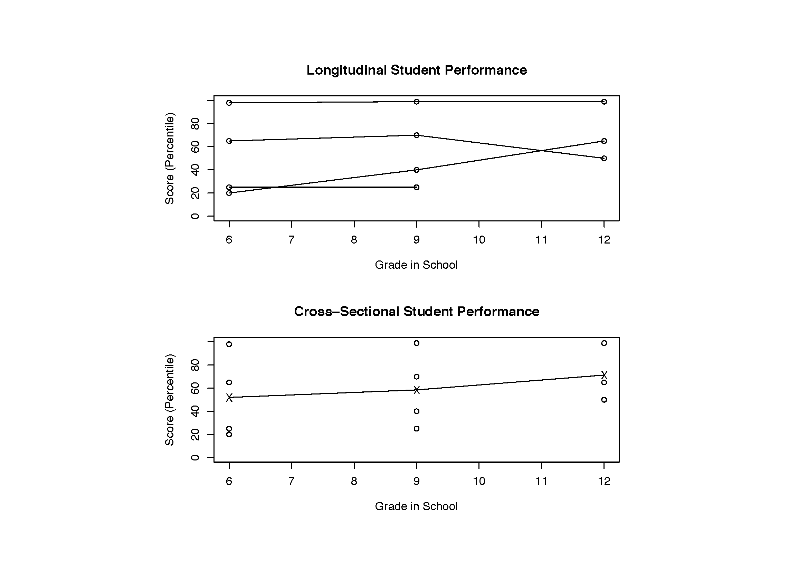
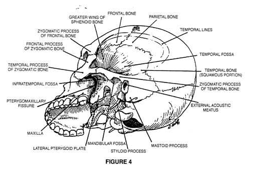
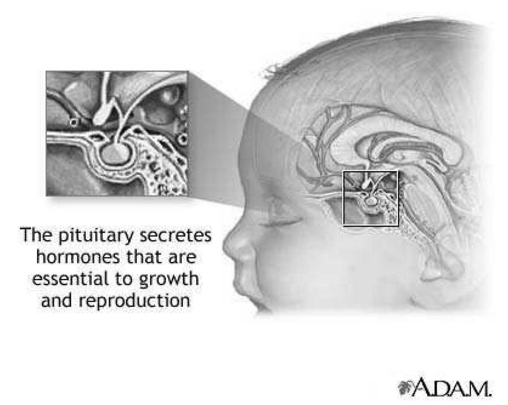

```{r setup, include=FALSE}
# R options
options(
  htmltools.dir.version = FALSE, # for blogdown
  show.signif.stars = FALSE,     # for regression output
  warm = 1
  )
# Set dpi and height for images
library(knitr)
knitr::opts_chunk$set(fig.height = 2.65, dpi = 300,fig.align='center',fig.show='hold',size='footnotesize', small.mar=TRUE) 
# For nonsese...
htmltools::tagList(rmarkdown::html_dependency_font_awesome())
```

```{r echo=FALSE, message=FALSE, warning=FALSE}
library(tidyverse)
library(rvest)
#library(tufte)
#library(sjPlot)
library(lme4)
#library(sjstats)
#library(merTools)
#library(lattice)
library(ggplot2)
```


## Linear mixed effects models

Linear mixed effects models extend standard linear models to allow for random effects. They overlap with hierarchical models in many ways.

You can think about the (linear) hierarchical models we have covered so far as special cases .

We introduce the framework of the linear mixed effects model in the context of longitudinal data.

Something to keep in mind: the following are all related.
  - mixed models
  - mixed effects models
  - random effects models
  - two-stage models
  - hierarchical models
  - multilevel models
  - Laird and Ware models


---
## Mixed effects models for longitudinal data


In (linear) mixed effects models, the response depends on the usual "fixed" population parameters $\beta$, as well as subject-specific random effects.

We have seen this already in context of the random effects ANCOVA model.

When dealing with longitudinal data, mixed effects models are especially convenient when there are no set times for observation of outcomes, which makes it challenging to estimate a covariance matrix across time in a multivariate setting.

**NOTE:** In the setting of longitudinal data, indices are typically the opposite of those in the regular multilevel modeling setting.

That is, $Y_{ij}$ often denotes the response at time $j$ for subject $i$. This is standard notation in the context of mixed effects models.

This is just notation, so we can switch back and forth easily as needed.


---
## Mixed effects models for longitudinal data

Because of missing data, differential timing, and other factors, $\text{Var}(Y_{ij})$ may depend on $i$ and $j$.

Mixed effects models handle such structures naturally.

We have already seen a bit of this with the random effect models we have seen so far.

In addition, using random effects in the model is one way to model the covariance structure as a function of time.

That said, there are many other ways of handling these kinds of "complicated" covariance structures, so a mixed effects model might not be the way to go when, say, a dynamic model would be a much better fit.


---
## Longitudinal versus cross-sectional data

In a .hlight[longitudinal study], subjects are measured repeatedly over time.

When these are the exact same "subjects" and variables over time, we have a .hlight[panel study].

We can think of these as multilevel data, with repeated measures on each individual subject (so the subject is the group).

In a .hlight[cross-sectional study], a single outcome is measured for each individual, though individuals may belong to different cohorts. 


---
## Longitudinal versus cross-sectional data

```{r echo=FALSE, out.height="550px",out.width="750px"}

```


---
## Longitudinal versus cross-sectional data

A key feature of the longitudinal design on the previous slide is that the same cohort of students, recruited in 6th grade, is followed until 12th grade (except in the case of *dropouts*).

The cross-sectional study can be completed at one point in time, with the 6th, 9th, and 12th grade cohorts tested concurrently.

<br>

In the cross-sectional study depicted, it is not possible to determine whether scores in 12th grade are better because for example, the teachers are better, students have learned more in earlier grades, the weaker students dropped out, etc.

A longitudinal design gives us much more information to assess the "reasons" for change.


---
## Longitudinal versus cross-sectional data

In the cross-sectional design, we do not have any repeated scores from the same student.

Often, observations may be treated as independent across groups.

In a longitudinal analysis, we can investigate

  - changes over time within individuals
  - differences among individuals in their response levels

Longitudinal data analysis requires special statistical methods (e.g., a multilevel model) because the observations on any one subject tend to be positively correlated.


---
## Orthodontics data

Changes in the distance (measured in mm) from the center of the pituitary gland to the pterygomaxillary fissure are important in orthodontic therapy.

```{r echo=FALSE, out.height="450px",out.width="400px"}

```


---
## Orthodontics data

```{r echo=FALSE, out.height="500px",out.width="450px"}

```


---
## Pothoff and Roy (1964) study

This distance was measured at ages 8, 10, 12, and 14 in 27 children (16 boys and 11 girls)
  
Questions of interest include the following:
  - Does distance change over time?
  - What is the pattern of change?
  - Is the pattern of change different for boys and girls?  How?
```{r readdata, message=FALSE, warning=FALSE}
data(Orthodont,package="nlme")
head(Orthodont); dim(Orthodont)
Orthodont$Sex <- relevel(Orthodont$Sex,ref="Female")
```


---
## Pothoff and Roy (1964) study

```{r plot1, echo=FALSE, warning=FALSE, message=FALSE, fig.height=4.5}
ggplot(Orthodont, aes(x=age,y=distance,color=Sex,group=Subject)) + 
  geom_point(alpha=0.4) + geom_line() + xlab("Age") + ylab("Distance (mm)") 
```

What kind of model might be appropriate?


---
## Modeling growth

To start, we might consider a linear model given by $$Y_{ij}=\beta_{0i}+\beta_{1i}t_{ij}+\varepsilon_{ij},$$ where $i$ indexes the child and $j$ indexes time $j=1,2,3,4$, and in this case, $t_{ij}=t_j$ as each child was measured at $t_1=8$, $t_2=10$, $t_3=12$, and $t_4=14$ years.

Recall our research questions:

  - Does distance change over time? (main effect of age)
  - What is the pattern of change? (linear age, categorical?)
  - Is the pattern of change different for boys and girls?  How? (age by gender interaction)

We might specify
$$
\begin{split}
Y_{ij} & =\beta_{0i}+\beta_{1i}t_{j}+\varepsilon_{ij} \\
\beta_{0i} & =\alpha_{00}+\alpha_{01}I(male)_i+b_{0i} \\
\beta_{1i} & =\alpha_{10}+\alpha_{11}I(male)_i+b_{1i}.
\end{split}
$$


---
## Linear mixed effects model

The standard representation for a linear mixed effects model is
$$
\begin{split}
Y_i & = X_i\beta+Z_ib_i+\varepsilon_i \\
b_i & \perp \varepsilon_i \ \ \ \ \ b_i \sim N_q(0,D)  \ \ \ \ \ \varepsilon_i \sim N_{n_i}(0,R_i),
\end{split}
$$
where
  - $Y_i$ is a $n_i \times 1$ vector of outcomes for subject $i$
  - $X_i$ is a $n_i \times p$ design matrix of predictor variables corresponding to each outcome measurement occasion for subject $i$ 
  - $Z_i$ is a $n_i \times q$ design matrix corresponding to the random effects for subject $i$
  - $\beta$ is a $p \times 1$ vector of regression coefficients (fixed effects)
  - $b_i$ is a $q \times 1$ vector of random effects for subject $i$
  - $\varepsilon_{i}$ is a $n_i \times 1$ vector of errors for subject $i$


---
## Linear mixed effects model

In this model, $$E(Y_i)=X_i\beta$$ and $$\text{Var}(Y_i)=\text{Var}(Z_ib_i+\varepsilon_i)=Z_iDZ_i'+R_i.$$

Here, $Z_i$ characterizes among-unit variation.

When the columns of $Z_i$ are a subset of the columns of $X_i$, we can interpret $Z_ib_i$ as the difference between subject $i$'s conditional mean response trajectory and the mean response trajectory in the population (that is, $b_i$ has mean zero).

Example: in a random intercept model, $Z_i$ is a $n_i \times 1$ vector of 1's.


---
## Linear mixed effects model

The subject-specific or conditional mean of $Y_i$ given $b_i$ is
$$E(Y_i \mid b_i)=X_i\beta+Z_ib_i.$$

The marginal or populatoin-averaged mean of $Y_i$, averaging over the distribution of random effects $b_i$ is given by
$$E(E(Y_i\mid b_i))=E(X_i\beta+Z_ib_i)=X_i\beta,$$

since $b_i$ has mean zero.


---
## Linear mixed effects model

If we have only a random intercept $b_{0i}$ and $\text{Var}(b_{0i})=\tau^2$ and $\text{Var}(\varepsilon_i)=\sigma^2I$, then
\begin{eqnarray*}
\text{Var}(Y_i) = \tau^2 Z_iZ_i'+\sigma^2I = \begin{pmatrix}
\sigma^2 + \tau^2 & \tau2 & \ldots & \tau^2 \\
\tau^2 & \sigma^2+\tau^2 & \ldots & \tau^2 \\
\vdots & \ldots & \ldots & \vdots \\
\tau^2 & \ldots & \ldots & \sigma^2+\tau^2
\end{pmatrix}.
\end{eqnarray*}

We have already seen this.

This form is called *compound symmetry* or *exchangeable* and represents the simplest possible example of a mixed effects model.


---
## Choices for $R_i$

The most common choice for the within-subject variation, $\text{Var}(\varepsilon_i)=R_i$, is $\sigma^2I_{n_i}$.

This implies that the error variance is the same at all time points and that there is no autocorrelation in the random errors. 

This may be appropriate if the main source of within-subject variation is measurement error. 

We could, however, choose more elaborate structures for $R_i$.

For example, we may feel $R_i$ depends on the value of a covariate or that an autoregressive structure is needed (observations made closer together in time may be more highly correlated than observations further apart in time).

This is a  distinction between standard multilevel models that typically assume $R_i=\sigma^2I_{n_i}$ and the linear mixed effects model, which allows a more general error variance.


---
## Example: children nested in families

Consider the model
$$
\begin{split}
y_{ij} & = \beta_{0,i}+\beta_{1,i}x_{ij}+\varepsilon_{ij} \\
\beta_{0,i} & = \beta_0+b_{0,i} ~~~ \beta_{1,i}=\beta_1+b_{1,i} \\
\left(\begin{array}{l} b_{0,i} \\ b_{1,i} \end{array}\right) & \overset{iid}\sim N\left( \left(\begin{array}{l} 0 \\ 0 \end{array}\right), \left(\begin{array}{ll} \tau_{11} & \tau_{12} \\ \tau_{12} & \tau_{22} \end{array}\right)\right) \perp   \varepsilon_{ij} \overset{iid}\sim N(0,\sigma^2),
\end{split}
$$
where  $i=1,\ldots,m$ families (groups) and $j=1,\ldots,n_i$ children within family $i$.


---
## Exercises

+ Write this model as a linear mixed effects model of the form
$$Y_i=X_i\beta+Z_ib_i+\varepsilon_i,$$
clearly specifying the elements of $Y_i$, $X_i$, $Z_i$ and $\beta$ and the distributional assumptions on $b_i$ and $\varepsilon_i$.


+ Derive the general form of the correlation between:

  - two children in different families $i$ and $i'$, $\text{Corr}(Y_{ij},Y_{i'j'})$
  - two children in the same family $i$, $\text{Corr}(Y_{ij},Y_{ij'})$
  
Tip: for the second part, you can either use the formula from a few slides back for $\text{Var}(Y_i)$, or you can derive from first principles as the covariance of two linear combinations of random variables.


---
## Dental data again

In the dental data, the kids are all measured at age 8, 10, 12, and 14 (Really? Did they all come in for the study on their birthdays?).

Probably the kids were measured within a few months of each age, and maybe some were pretty late. 

How can this model accommodate unequal or unbalanced measurement times?


---
## Choices for $D$

$\text{Var}(b_i) = D$ could be different for different groups if there is strong evidence different treatment conditions have a nonnegligible effect on variation as well as on the mean.

Typically $D$ is unstructured.

Intercepts and slopes may tend to be large or small together, so that children with steeper slopes tend to "start out" larger at birth -- or the opposite may be true -- perhaps small kids tend to grow faster in order to catch up.

Either way, it's generally unwise to specify $D$ as diagonal.


---
## Choices for $D$

In a random intercepts and slopes model, we may have $$\text{Var}(b_i)=\text{Var}\begin{pmatrix}b_{0i}\\b_{1i}\end{pmatrix}=D=\begin{pmatrix}d_{11} & d_{12} \\ d_{12} & d_{22} \end{pmatrix}.$$ $d_{11}=d_{22}$ (homogeneous variances) is generally unrealistic because the intercept is on the same measurement scale as $Y$, but the slope is on the scale of "response increment per unit change in predictor."

So unstructured $D$ is usually the way to go.


---
## Choices for $D$

One problem with trying to get "too fancy" in modeling $D$ and $R_i$ is that we may run into *identifiability* issues. 

For example, it is not possible in a frequentist model to estimate both unstructured $D$ and unstructured $R_i$ as the number of free parameters in those matrices exceeds the number of free components in the matrix $\text{Var}(Y_i)$.

For example, suppose $Y_i$ contains 4 response measures for each participant in a study, with each participant measured at the same 4 times. 

$\text{Cov}(Y_i)=\Sigma$ is a $4\times 4$ matrix and has $\frac{n(n+1)}{2}=10$ unique elements.

How many covariance parameters would we need to estimate if we assume $R_i$ is unstructured in a model with random intercepts and slopes?


---
## Dental data again

Translating our model from the multilevel formulation
.block[
$$
\begin{split}
Y_{ij} & =\beta_{0i}+\beta_{1i}t_{j}+\varepsilon_{ij} \\
\beta_{0i} & =\alpha_{00}+\alpha_{01}I(male)_i+b_{0i} \\
\beta_{1i} & =\alpha_{10}+\alpha_{11}I(male)_i+b_{1i}.
\end{split}
$$
]

to a standard mixed model formulation (just rewriting and changing notation) we have
.block[
$$Y_{ij}=\beta_0+\beta_1I(\text{male})_i+\beta_2t_j+\beta_3I(\text{male})_it_j + b_{0i} + b_{1i}t_j + \varepsilon_{ij}$$
]
where
.block[
$$\begin{pmatrix} b_{0i} \\ b_{1i} \end{pmatrix} \overset{iid}\sim N\left(0,\begin{pmatrix}d_{11} & d_{12} \\ d_{12} & d_{22}\end{pmatrix}\right) \perp \varepsilon_{ij} \overset{iid}\sim N(0,\sigma^2).$$
]

Let's fit and interpret this model!


---
## Dental analysis

.large[
```{r dent}
m1 <- lmer(distance~ Sex*age+(1+age|Subject),data=Orthodont)
summary(m1)
```
]


---
## Dental analysis

We'll get more into diagnostics shortly, but here's a start.

```{r resid, fig.height=4}
library(lattice)
#basic qqplot
qqmath(resid(m1))
```


---
## Dental analysis

```{r resid2, fig.height=4}
#standardized residuals y-Xbeta-Zb versus fitted values by gender
#standardized by the estimate of sigma=sqrt(var(epsilon))
plot(m1,resid(.,scaled=TRUE)~fitted(.)|Sex,abline=0)
```


---
## Dental analysis

```{r resid3, fig.height=4}
## boxplots of residuals by Subject
plot(m1, Subject ~ resid(., scaled=TRUE))
```


---
## Dental analysis

```{r resid4, fig.height=4}
## observed versus fitted values by Subject
## fitted value is X_ibeta+Z_ib_i
plot(m1, distance ~ fitted(.) | Subject, abline = c(0,1))
```


---
## Dental analysis

```{r resid5, fig.height=4.5}
## residuals by age, separated by Subject
plot(m1, resid(., scaled=TRUE) ~ age | Sex, abline = 0)
```


---
## Dental analysis

```{r resid6, fig.height=3.5,warning=FALSE}
m1F <- fortify.merMod(m1)
# plot of raw residuals, use .scresid for scaled
ggplot(m1F, aes(age,.resid)) + geom_point(colour="blue") + facet_grid(.~Sex) +
  geom_hline(yintercept=0)+geom_line(aes(group=Subject),alpha=0.4) +
  geom_smooth(method="loess")
```


---
## Model results

Note the t-statistic for the interaction is a pretty good size, so we'll keep that in the model. 

Let's pick off intercepts and slopes for girls and boys along with 95% confidence intervals.

```{r intslopes, fig.height=4.5}
#int girl, int boy, slope girl, slope boy
cmat <- cbind(c(1,0,0,0),c(1,1,0,0),c(0,0,1,0),c(0,0,1,1))
girlboyintslope <- t(cmat)%*%fixef(m1)
gbvcov <- t(cmat)%*%vcov(m1)%*%cmat
cbind(girlboyintslope-1.96*sqrt(diag(gbvcov)),
      girlboyintslope,girlboyintslope+1.96*sqrt(diag(gbvcov)))
```


---
## Model results

```{r plotlines,eval=FALSE, fig.height=4.5}
est <- data.frame(sl = girlboyintslope[3:4,], 
                 int = girlboyintslope[1:2,], 
                 SEX = c('Female','Male'))
ggplot(Orthodont, aes(x=age,y=distance,color=Sex,group=Subject)) +
  geom_point(alpha=0.8) + geom_line(alpha=0.3) +
  geom_abline(data=est, aes(intercept=int, slope=sl, color=SEX)) +
  xlab("Age (years)") + ylab("Distance (mm)") + 
  ggtitle("Observed Data and Estimated Gender-Specific Means")
```


---
## Model results

Here, we examine the gender-specific mean trends over time from the model along with the observed data points.

```{r plotlines2,echo=FALSE, fig.height=4.2}
est <- data.frame(sl = girlboyintslope[3:4,], 
                 int = girlboyintslope[1:2,], 
                 SEX = c('Female','Male'))
ggplot(Orthodont, aes(x=age,y=distance,color=Sex,group=Subject)) + 
  geom_point(alpha=0.8) + geom_line(alpha=0.3) +
  geom_abline(data=est, aes(intercept=int, slope=sl, color=SEX)) +
  xlab("Age (years)") + ylab("Distance (mm)") + 
  ggtitle("Observed Data and Estimated Gender-Specific Means")
```


---
## Model results

Now we look at individual-specific and mean estimated trajectories.

```{r plotrandomlines,eval=FALSE}
boyint <- coef(m1)$Subject[1:16,1]+coef(m1)$Subject[1:16,2]
girlint <- coef(m1)$Subject[17:27,1]
boyslope <- coef(m1)$Subject[1:16,3]+coef(m1)$Subject[1:16,4]
girlslope <- coef(m1)$Subject[17:27,3]
int <- c(boyint,girlint)
sl <- c(boyslope,girlslope)
est2 <- data.frame(sl,int, 
                 SEX = c(rep('Male',16),rep('Female',11)))
ggplot(Orthodont, aes(x=age,y=distance,color=Sex,group=Subject)) + 
  geom_abline(data=est2, aes(intercept=int, slope=sl, color=SEX),alpha=.2) + 
  geom.point(alpha=0)
  geom_abline(data=est, aes(intercept=int, slope=sl, color=SEX)) +
  xlab("Age (years)") + ylab("Distance (mm)") + 
  ggtitle("Trajectories by Gender")

```


---
## Model results

```{r plotrandomline2,echo=FALSE, fig.height=4.2}
boyint <- coef(m1)$Subject[1:16,1]+coef(m1)$Subject[1:16,2]
girlint <- coef(m1)$Subject[17:27,1]
boyslope <- coef(m1)$Subject[1:16,3]+coef(m1)$Subject[1:16,4]
girlslope <- coef(m1)$Subject[17:27,3]
int <- c(boyint,girlint)
sl <- c(boyslope,girlslope)
est2 <- data.frame(sl,int, 
                 SEX = c(rep('Male',16),rep('Female',11)))
ggplot(Orthodont, aes(x=age,y=distance,color=Sex,group=Subject)) + geom_point(alpha=0.0) +
  geom_abline(data=est2, aes(intercept=int, slope=sl, color=SEX),alpha=.2) + 
  geom_abline(data=est, aes(intercept=int, slope=sl, color=SEX)) +
  xlab("Age (years)") + ylab("Distance (mm)") + 
  ggtitle("Trajectories by Gender")

```


---

class: center, middle

# What's next?

### Move on to the readings for the next module!


