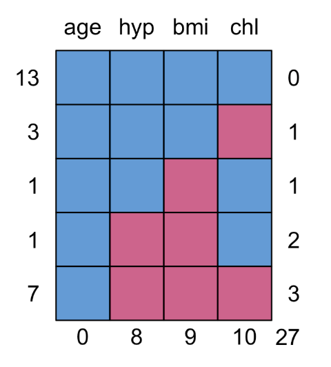

```{r setup, include=FALSE}
# R options
options(
  htmltools.dir.version = FALSE, # for blogdown
  show.signif.stars = FALSE,     # for regression output
  warm = 1
  )
# Set dpi and height for images
library(knitr)
knitr::opts_chunk$set(fig.height = 2.65, dpi = 300,fig.align='center',fig.show='hold',size='footnotesize', small.mar=TRUE) 
# For nonsese...
htmltools::tagList(rmarkdown::html_dependency_font_awesome())
```

```{r echo=FALSE, message=FALSE, warning=FALSE}
library(tidyverse)
library(rvest)
library(rethinking)
library(VIM)
library(optmatch)
library(ggplot2)
library(brms)
library(optmatch)
library(parsnip)
```


## Introduction to missing data

Missing data/nonresponse is fairly common in real data and applications.

For example,

  + Failure to respond to a survey question.
  
  + Subject misses some clinic visits out of all possible.
  
  + Only subset of subjects are asked certain questions.
  
The most common software packages often throw away all subjects with incomplete data (can lead to bias and precision loss).


---
## Introduction to missing data

Ideally, analysts should first decide on how to deal with missing data before moving on to analysis. 

One needs to make assumptions and ask tons of questions, for example,
  + why are the values missing?
  
  + what is the pattern of missingness?
  
  + what is the proportion of missing values in the data?

As a Bayesian, one could treat the missing values as parameters and estimate them simultaneously with the analysis, but even in that case, one must still ask the same questions.

Ask as many questions as possible to help you figure out the most plausible assumptions!


---
## Introduction to missing data

Simplest approach: complete/available case analyses -- delete cases with missing data.

Often problematic because:
  + it is just not feasible sometimes (small $n$ large $p$ problem) -- when we have a small number of observations but a large number of variables, we simply can not afford to throw away data, even when the proportion of missing data is small.
  
  + information loss -- even when we do not have the small $n$, large $p$ problem, we still lose information when we delete cases.
  
  + biased results -- because the missing data mechanism is rarely random, features of the observed data can be completely different from the missing data.

More principled approach: impute the missing data (in a statistically proper fashion) and analyze the imputed data.


---
## Why should we care?

- <font color="red">Loss of power</font> due to the the smaller sample size  
  + can't regain lost power.

- Any analysis must make an <font color="red">untestable assumption</font> about the missing data
  + wrong assumption $\Rightarrow$ <font color="red">biased estimates</font>.

- Some popular analyses with missing data get <font color="red">biased standard errors</font>
  + resulting in wrong p-values and confidence intervals.

- Some popular analyses with missing data are <font color="red">inefficient</font>
  + so that confidence intervals are wider than they need be.


---
## What to do: loss of power

Approach by design:

- minimize amount of missing data
  + good communications with participants, for example, patients in clinical trial, participants in surveys and censuses, etc
  + follow up as much as possible; make repeated attempts using different methods
    
- reduce the impact of missing data
  + collect reasons for missing data
  + collect information predictive of missing values
    
    
---
## What to do: analysis

A suitable method of analysis would:
  + make the correct (or plausible) assumption about the missing data
  
  + give an unbiased estimate (under that assumption)
  
  + give an unbiased standard error (so that p-values and confidence intervals are correct)
  
  + be efficient (make best use of the available data)

However, we can never be sure about what the correct assumption is $\Rightarrow$ sensitivity analyses are essential!


---
## How to approach the analysis?

Start by knowing:
  + extent of missing data
  + pattern of missing data (e.g. is $X_1$ always missing whenever $X_2$ is also missing?)
  + predictors of missing data and of outcome

Principled approach to missing data:
  + identify a plausible assumption (through discussions between you as a data scientist and your clients)
  + choose an analysis method that's valid under that assumption
  
Just because a method is simple to use does not make it plausible; some analysis methods are simple to describe but have complex and/or implausible assumptions.


---
## Handling missing data

Many analysts still impute missing values with a mean or some other fixed (single) value (ignores uncertainty).

However, it is generally better to rely on methods that can incorporate the uncertainty around imputed values (see Little and Rubin (2019)).

A common approach for doing this is .hlight[multiple imputation] (see .hlight[mice] package in R).

Again, imputing missing data is quite natural in the Bayesian context since each missing value is simply treated as an additional parameter.

In fact, multiple imputation basically relies on Bayesian ideas.

Thus, we will focus on handling missing data in Bayesian models.

If you would like to learn about multiple imputation, see the slides [here](https://ids702-f21.olanrewajuakande.com/slides/5-3-imputation-methods-II.html#1) and [here](https://ids702-f21.olanrewajuakande.com/slides/5-4-imputation-methods-III.html#1).


---
## Pattern of missing data

Missing data patterns may be .hlight[monotone] or .hlight[nonmonotone]. 

In a .hlight[monotone missing data pattern], observations missing on one variable are a subset of those missing on another variable. That is, missingness is nested.

One example of monotone missing data is study *dropout*. If a subject drops out of a study at time $t$, then their observations will also be missing at times $t+1$, $t+2$, and so forth.

When missing data follow such a pattern, the group of responses is never larger at a later follow-up time than it is at an earlier time.

Missing data are .hlight[nonmonotone] when missingness is not nested in this manner, or is intermittent.  


---
## Types of nonresponse (missing data)

.hlight[Unit nonresponse]: the individual has no values recorded for any of the variables.

.hlight[Item nonresponse]: the individual has values recorded for at least one variable, but not all variables.

<table>
  <caption>Unit nonresponse vs item nonresponse</caption>
  <tr>
    <th> </th>
    <th height="30px" colspan="3">Variables</th>
  </tr>
  <tr>
    <th>  </th>
    <td height="30px" style="text-align:center" width="100px"> X<sub>1</sub> </td>
    <td style="text-align:center" width="100px"> X<sub>2</sub> </td>
    <td style="text-align:center" width="100px"> Y </td>
  </tr>
  <tr>
    <td height="30px" style="text-align:left"> Complete cases </td>
    <td style="text-align:center"> &#10003 </td>
    <td style="text-align:center"> &#10003 </td>
    <td style="text-align:center"> &#10003 </td>
  </tr>
  <tr>
    <td rowspan="3"> Item nonresponse </td>
    <td rowspan="3" style="text-align:center"> &#10003 </td>
    <td height="30px" style="text-align:center"> &#10003 </td>
    <td style="text-align:center"> &#10067 </td>
  </tr>
  <tr>
    <td height="30px" style="text-align:center"> &#10067 </td>
    <td style="text-align:center"> &#10067 </td>
  </tr>
  <tr>
    <td height="30px" style="text-align:center"> &#10067 </td>
    <td style="text-align:center"> &#10003 </td>
  </tr>
  <tr>
    <td height="30px" style="text-align:left"> Unit nonresponse </td>
    <td style="text-align:center"> &#10067 </td>
    <td style="text-align:center"> &#10067 </td>
    <td style="text-align:center"> &#10067 </td>
  </tr>
</table>


---
## Strategies for handling missing data

Item nonresponse:
  + use complete/available cases analyses
  + single imputation methods
  + multiple imputation
  + model-based methods

Unit nonresponse: 
  + weighting adjustments
  + model-based methods (identifiability issues!).

.hlight[We focus primarily on item nonresponse. Discussions on unit nonresponse are beyond the scope of this course].

Building models for both unit and item nonresponse usually follows along the lines of: https://arxiv.org/abs/1907.06145. 


---
## Missing data mechanisms

Data are said to be .hlight[missing completely at random (MCAR)] if the reason for missingness does not depend on the values of the observed data or missing data.

For example, suppose
  - you handed out a double-sided survey questionnaire of 20 questions to a sample of participants;
  - questions 1-15 were on the first page but questions 16-20 were at the back; and
  - some of the participants did not respond to questions 16-20.
 
Then, the values for questions 16-20 for those people who did not respond would be .hlight[MCAR] if they simply did not realize the pages were double-sided; they had no reason to ignore those questions.
 
**This is rarely plausible in practice!**


---
## Missing data mechanisms

Data are said to be .hlight[missing at random (MAR)] if, conditional on the values of the observed data, the reason for missingness does not depend on the missing data.

Using our previous example, suppose
  - questions 1-15 include demographic information such as age and education;
  - questions 16-20 include income related questions; and
  - once again, some participants did not respond to questions 16-20.

Then, the values for questions 16-20 for those people who did not respond would be .hlight[MAR] if younger people are more likely not to respond to those income related questions than old people, where age is observed for all participants.
  
**This is the most commonly assumed mechanism in practice!**


---
## Missing data mechanisms

Data are said to be .hlight[missing not at random (MNAR or NMAR)] if the reason for missingness depends on the actual values of the missing (unobserved) data.

Continuing with our previous example, suppose again that
  - questions 1-15 include demographic information such as age and education;
  - questions 16-20 include income related questions; and
  - once again, some of the participants did not respond to questions 16-20.

Then, the values for questions 16-20 for those people who did not respond would be .hlight[MNAR] if people who earn more money are less likely to respond to those income related questions than old people.

**This is usually the case in real data, but analysis can be complex!**


---
## Mathematical formulation

Consider the multivariate data $\boldsymbol{Y}_i = (\boldsymbol{Y}_1,\ldots,\boldsymbol{Y}_n)^T$, where $\boldsymbol{Y}_i = (Y_{i1},\ldots,Y_{ip})^T$, for $i = 1,\ldots, n$.

For now, we will assume the multivariate normal model as the sampling model, so that each $\boldsymbol{Y}_i = (Y_{i1},\ldots,Y_{ip})^T \sim \mathcal{N}_p(\boldsymbol{\theta}, \Sigma)$.

It is easy to extend the formulation to allow for predictors, and also within the context of hierarchical modeling.

Suppose now that $\boldsymbol{Y}$ contains missing values.

We can separate $\boldsymbol{Y}$ into the observed and missing parts, that is, $\boldsymbol{Y} = (\boldsymbol{Y}_{obs},\boldsymbol{Y}_{mis})$.

Then for each individual, $\boldsymbol{Y}_i = (\boldsymbol{Y}_{i,obs},\boldsymbol{Y}_{i,mis})$.


---
## Mathematical Formulation

Let
  + $j$ index variables (where $i$ already indexes individuals),
  + $r_{ij} = 1$ when $y_{ij}$ is missing,
  + $r_{ij} = 0$ when $y_{ij}$ is observed.

Here, $r_{ij}$ is known as the missingness indicator of variable $j$ for person $i$. 

Also, let 
  + $\boldsymbol{R}_i = (r_{i1},\ldots,r_{ip})^T$ be the vector of missing indicators for person $i$.
  + $\boldsymbol{R} = (\boldsymbol{R}_1,\ldots,\boldsymbol{R}_n)$ be the matrix of missing indicators for everyone.
  + $\boldsymbol{\psi}$ be the set of parameters associated with $\boldsymbol{R}$.

Assume $\boldsymbol{\psi}$ and $(\boldsymbol{\theta}, \Sigma)$ are distinct.


---
## Mathematical Formulation

MCAR:
.block[
$$p(\boldsymbol{R} | \boldsymbol{Y},\boldsymbol{\theta}, \Sigma, \boldsymbol{\psi}) = p(\boldsymbol{R} | \boldsymbol{\psi})$$
]


MAR:
.block[
$$p(\boldsymbol{R} | \boldsymbol{Y},\boldsymbol{\theta}, \Sigma, \boldsymbol{\psi}) = p(\boldsymbol{R} | \boldsymbol{Y}_{obs},\boldsymbol{\psi})$$
]


MNAR:
.block[
$$p(\boldsymbol{R} | \boldsymbol{Y},\boldsymbol{\theta}, \Sigma, \boldsymbol{\psi}) = p(\boldsymbol{R} | \boldsymbol{Y}_{obs},\boldsymbol{Y}_{mis},\boldsymbol{\psi})$$
]


---
## Implications for likelihood function

Each type of mechanism has a different implication on the likelihood of the observed data $\boldsymbol{Y}_{obs}$, and the missing data indicator $\boldsymbol{R}$.

Without missingness in $\boldsymbol{Y}$, the likelihood of the observed data is
.block[
$$p(\boldsymbol{Y}_{obs} | \boldsymbol{\theta}, \Sigma)$$
]

With missingness in $\boldsymbol{Y}$, the likelihood of the observed data is instead
.block[
$$
\begin{split}
p(\boldsymbol{Y}_{obs}, \boldsymbol{R} |\boldsymbol{\theta}, \Sigma, \boldsymbol{\psi}) & = \int p(\boldsymbol{R} | \boldsymbol{Y}_{obs},\boldsymbol{Y}_{mis},\boldsymbol{\psi}) \cdot p(\boldsymbol{Y}_{obs},\boldsymbol{Y}_{mis} | \boldsymbol{\theta}, \Sigma) \textrm{d}\boldsymbol{Y}_{mis} \\
\end{split}
$$
]

Since we do not actually observe $\boldsymbol{Y}_{mis}$, we would like to be able to integrate it out so we don't have to deal with it.

That is, we would like to infer $(\boldsymbol{\theta}, \Sigma)$ (and sometimes, $\boldsymbol{\psi}$) using only the observed data.


---
## Likelihood function: MCAR

For MCAR, we have:
.block[
$$
\begin{split}
p(\boldsymbol{Y}_{obs}, \boldsymbol{R} |\boldsymbol{\theta}, \Sigma, \boldsymbol{\psi}) & = \int p(\boldsymbol{R} | \boldsymbol{Y}_{obs},\boldsymbol{Y}_{mis},\boldsymbol{\psi}) \cdot p(\boldsymbol{Y}_{obs},\boldsymbol{Y}_{mis} | \boldsymbol{\theta}, \Sigma) \textrm{d}\boldsymbol{Y}_{mis} \\
& = \int p(\boldsymbol{R} | \boldsymbol{\psi}) \cdot p(\boldsymbol{Y}_{obs},\boldsymbol{Y}_{mis} | \boldsymbol{\theta}, \Sigma) \textrm{d}\boldsymbol{Y}_{mis} \\
& = p(\boldsymbol{R} | \boldsymbol{\psi}) \cdot \int p(\boldsymbol{Y}_{obs},\boldsymbol{Y}_{mis} | \boldsymbol{\theta}, \Sigma) \textrm{d}\boldsymbol{Y}_{mis} \\
& = p(\boldsymbol{R} | \boldsymbol{\psi}) \cdot p(\boldsymbol{Y}_{obs} | \boldsymbol{\theta}, \Sigma). \\
\end{split}
$$
]

For inference on $(\boldsymbol{\theta}, \Sigma)$, we can simply focus on $p(\boldsymbol{Y}_{obs} | \boldsymbol{\theta}, \Sigma)$ in the likelihood function, since $(\boldsymbol{R} | \boldsymbol{\psi})$ does not include any $\boldsymbol{Y}$.

That is, the missing-data mechanism here is .hlight[ignorable] for likelihood-based inference.


---
## Likelihood function: MAR

For MAR, we have:
.block[
$$
\begin{split}
p(\boldsymbol{Y}_{obs}, \boldsymbol{R} |\boldsymbol{\theta}, \Sigma, \boldsymbol{\psi}) & = \int p(\boldsymbol{R} | \boldsymbol{Y}_{obs},\boldsymbol{Y}_{mis},\boldsymbol{\psi}) \cdot p(\boldsymbol{Y}_{obs},\boldsymbol{Y}_{mis} | \boldsymbol{\theta}, \Sigma) \textrm{d}\boldsymbol{Y}_{mis} \\
& = \int p(\boldsymbol{R} | \boldsymbol{Y}_{obs}, \boldsymbol{\psi}) \cdot p(\boldsymbol{Y}_{obs},\boldsymbol{Y}_{mis} | \boldsymbol{\theta}, \Sigma) \textrm{d}\boldsymbol{Y}_{mis} \\
& = p(\boldsymbol{R} | \boldsymbol{Y}_{obs},\boldsymbol{\psi}) \cdot \int p(\boldsymbol{Y}_{obs},\boldsymbol{Y}_{mis} | \boldsymbol{\theta}, \Sigma) \textrm{d}\boldsymbol{Y}_{mis} \\
& = p(\boldsymbol{R} | \boldsymbol{Y}_{obs},\boldsymbol{\psi}) \cdot p(\boldsymbol{Y}_{obs} | \boldsymbol{\theta}, \Sigma). \\
\end{split}
$$
]

For inference on $(\boldsymbol{\theta}, \Sigma)$, we can once again focus on $p(\boldsymbol{Y}_{obs} | \boldsymbol{\theta}, \Sigma)$ in the likelihood function. Again, the missing-data mechanism is .hlight[ignorable].

However, there can be some bias if we do not account for $p(\boldsymbol{R} | \boldsymbol{Y}_{obs},\boldsymbol{\psi})$, especially if $\boldsymbol{\psi}$ and $(\boldsymbol{\theta}, \Sigma)$ are not distinct.

Also, if we want to infer the missingness mechanism through $\boldsymbol{\psi}$, we would need to deal with $p(\boldsymbol{R} | \boldsymbol{Y}_{obs},\boldsymbol{\psi})$ anyway.


---
## Likelihood function: MNAR

For MNAR, we have:
.block[
$$
\begin{split}
p(\boldsymbol{Y}_{obs}, \boldsymbol{R} |\boldsymbol{\theta}, \Sigma, \boldsymbol{\psi}) & = \int p(\boldsymbol{R} | \boldsymbol{Y}_{obs},\boldsymbol{Y}_{mis},\boldsymbol{\psi}) \cdot p(\boldsymbol{Y}_{obs},\boldsymbol{Y}_{mis} | \boldsymbol{\theta}, \Sigma) \textrm{d}\boldsymbol{Y}_{mis} \\
\end{split}
$$
]

The likelihood under MNAR cannot simplify any further.
  
In this case, we cannot ignore the missing data when making inferences about $(\boldsymbol{\theta}, \Sigma)$ (.hlight[nonignorable missing-data mechanism]).
  
We must include the model for $\boldsymbol{R}$ and also infer the missing data $\boldsymbol{Y}_{mis}$.


---
## Missing data mechanisms: how to tell in practice?

So how can we tell the type of mechanism we are dealing with? 

In general, we don't know!!!

So, when conducting studies, it is very important to do everything possible to collect data on the reasons for missing values or dropouts, so that the investigator can determine the missing data mechanism.

That way, the decision can be made regarding the missing mechanism, and analysis can properly account for the missing data mechanism if necessary.


---
## Missing data mechanisms: how to tell in practice?

Rare (very!) that data are MCAR (unless planned beforehand)

Possible that data are MNAR

**Compromise**: assume data are MAR if we include enough variables in model for the missing data indicator $\boldsymbol{R}$.

Again, we will mostly focus on talking about missing data in the context of MCAR and MAR.


---
## Covariate-dependent missingness

What happens when there are also covariates to consider?

Well, in general, missingness in the outcomes that depends on covariates is not a problem, as long as you condition on the covariates.  

As a very simple example, let $X_i$ be a treatment group indicator, with $Y_i \sim N(\mu_0,\sigma^2)$ if $X_i=0$ and $Y_i \sim N(\mu_1,\sigma^2)$ if $X_i=1$.

Suppose that $X_i$ is always observed but that some $Y_i$ are missing.  

Write
$$Pr(R_i=1 | X_i=0)=\pi_0 ~~~~~~~~Pr(R_i=1 | X_i=1)=\pi_1,$$
so that $Pr(R_i=1 | Y_i, X_i) = Pr(R_i=1 | X_i)$.


Conditional on treatment group, the observed $Y_i$'s are a random subgroup of all responses within a treatment group.


---
## Covariate-dependent missingness

Then we can show that
$$E(Y_i \mid R_i=1,X_i)=E(Y_i \mid X_i)$$

and
$$f(Y_i \mid R_i=1,X_i)=f(Y_i \mid X_i)$$

but
$$E(Y_i \mid R_i=1) \neq E(Y_i).$$ 

However, because we are not interested in $E(Y_i)$ averaged over treatment groups, this is not a concern.

Conditional on $X_i$, our missingness is MCAR, so inferences based on complete data will be valid.

If we do not condition on $X_i$, and $X_i$ and $Y_i$ are related, then lack of conditioning on $X_i$ may introduce bias into the analysis.


---
## Illustration

Simple example using data that come with the .hlight[MICE] package in R.

Dataset from NHANES includes 25 cases measured on 4 variables.

Only 13 cases with complete data.

The four variables are
  1. age (age group: 20-39, 40-59, 60+)
  2. bmi (body mass index, in $kg/m^2$)
  3. hyp (hypertension status: no, yes)
  4. chl (total cholesterol, in $mg/dL$)
  
Suppose the goal is to predict `bmi` by `age`, and `chl`.


---
## Illustration

```{r message=F,warning=F}
library(mice)
data(nhanes2)
dim(nhanes2)
summary(nhanes2)
str(nhanes2)
```


---
## Patterns of missing data

```{r eval=F}
md.pattern(nhanes2)
```
```{r echo=FALSE, out.height="400px",out.width="450px"}

```

5 patterns observed from $2^3=8$ possible patterns


---
## Patterns of missing data

```{r echo=FALSE, out.height="320px",out.width="450px"}

```

.hlight[At the bottom]: total number of missing values by variables.

.hlight[On the right]: number of variables missing in each pattern.

.hlight[On the left]: number of cases for each pattern.


---
## Visualizing patterns of missing data

```{r fig.height=3.2, warning=F}
library(VIM); library(lattice)
aggr(nhanes2,col=c("lightblue3","darkred"),numbers=TRUE,sortVars=TRUE,
     labels=names(nhanes2),cex.axis=.7,gap=3,
     ylab=c("Proportion missing","Missingness pattern"))
```


---
## Visualizing patterns of missing data

The .hlight[marginplot] function can be used to understand how missingness affects the distribution of values on other variables.

.hlight[Blue box plots] summarize the distribution of .hlight[observed data given the other variable is observed].

.hlight[Red box plots] summarize the distribution of .hlight[observed data given the other variable is missing].

If data are MCAR, you expect the boxplots to be the same (hard to evaluate in this small sample)

Let's look at the margin plot for the two continuous variables `bmi` and `chl`.


---
## Visualizing patterns of missing data

```{r fig.height=4.5}
marginplot(nhanes2[,c("chl","bmi")],col=c("lightblue3","darkred"),cex.numbers=1.2,pch=19)
```


---
## Visualizing patterns of missing data

Interpretation of the numbers in red.

  + 9 = number of observations with missingness in `bmi`
  
  + 10 = number of observations with missingness in `chl`
  
  + 7 = number of observations with missingness in both `bmi` and `chl`.

The scatterplot of blue points display the relationship between `bmi` and `chl` when they are both observed (13 cases).

The red points indicate the amount of data used to generate the red boxplots.


---
## Imputation during model fitting

We will do this process a bit more carefully using the next example.

For now, the code for fitting the model to predict `bmi` by `age`, and `chl` using the .hlight[brms] package and imputing the missing values within the sampler is as follows.

```{r eval = F,cache=TRUE, warning=F,message=F}
bform <- bf(bmi | mi() ~ age * mi(chl)) +
   bf(chl | mi() ~ age) +
  set_rescor(FALSE)
fit_imp <- brm(bform, data = nhanes2,
               iter = 1e4, chains = 2, cores = 2,
               seed = 14, control=list(adapt_delta=0.99))
summary(fit_imp)
```

**Note:** this handles MAR, but clearly not MNAR/NMAR.


---
## Results

.small[
```{r, cache=TRUE, warning=F,message=F}
bform <- bf(bmi | mi() ~ age * mi(chl)) +
  bf(chl | mi() ~ age) +
  set_rescor(FALSE)

fit_imp <- brm(bform, data = nhanes2,
               iter = 1e4, chains = 2, cores = 2,
               seed = 14, control=list(adapt_delta=0.99))
summary(fit_imp)
```
]


---
## A slightly more interesting example

Researchers are interested in the hypothesis that primates with larger brains produce milk with higher energy content so that brains can grow more quickly.

We consider the .hlight[outcome of energy content in milk] (kcal of energy per g of milk) and predictors including the average female body mass (kg) and the percent of total brain mass that is neocortex mass.

The neocortex is the grey, outer part of the brain that is particularly developed in mammals, especially primates.

Here, we will deal with missing values in the predictors; the response is fully observed.


---
## Missing data in milk study

```{r mdata, message=FALSE, warning=FALSE, eval=FALSE}
library(rethinking)
library(tidyverse)
data(milk)
d <- milk
library(VIM)
milk_aggr <- aggr(d,numbers=TRUE,sortVars=TRUE, labels=names(d),
                  cex.axis=.7, gap=3,
                  ylab=c("Proportion missing","Missingness Pattern"))
```


---
## Missing data in milk study

.small[
```{r mdata2, message=FALSE, warning=FALSE, echo=FALSE, fig.height=3.4}
data(milk)
d <- milk
milk_aggr <- aggr(d,numbers=TRUE,sortVars=TRUE, labels=names(d),
                  cex.axis=.7, gap=3,
                  ylab=c("Proportion missing","Missingness Pattern"))
```
]


---
## Missing data in milk study

Here we see that only one variable, the percent neocortex, is subject to missingness, and it is missing 41% of the time (12 of 29 observations are NA).

This substantial fraction of missing data could lead to significant bias in association estimates of interest.


---
## Missing data in milk study

Again, we can easily impute missing values of neocortex in our Bayesian framework.

The only change to our model (assuming data are MCAR or MAR) is that we will specify a distribution for percent neocortex (a covariate -- usually we do not specify covariate distributions, though we did last time in the presence of measurement error).

How do the observed values of percent neocortex look?

```{r hist,eval=FALSE,warning=FALSE}
library(ggplot2)
ggplot(d, aes(x=neocortex.perc)) + geom_histogram(binwidth=6)
```


---
## Missing data in milk study


```{r hist2,echo=FALSE,warning=FALSE,fig.height=3.5}
ggplot(d, aes(x=neocortex.perc)) + geom_histogram(binwidth=6)
```

Ahh, histogram...looks normal-ish if you pick the right number of bins and has an icky left tail if you don't.  


---
## Data model

Let's think about the data model we would fit in the absence of missing data. For today we're going to think about standard linear regression.

Easy to extend the ideas to more complicated models.

First, let's normalize both predictors and the outcome to obtain new variables $M_i$, $N_i$, and $K_i$ in order to put them on the same scale (a SD scale).

We will also take the log of mass (it is highly skewed) -- not to make it normal, but just to pull in the tail values a bit.

```{r normalize}
d$M <- (log(d$mass)-mean(log(d$mass)))/sqrt(var(log(d$mass)))
d$N <- (d$neocortex.perc-
          mean(d$neocortex.perc,na.rm=T))/sqrt(var(d$neocortex.perc,na.rm=T))
d$K <- (d$kcal.per.g-mean(d$kcal.per.g))/sqrt(var(d$kcal.per.g))

```


---
## Data model

A reasonable data model is
$$K_i \sim N(\mu_i,\sigma^2) ~~~~~ \mu_i=\beta_0+\beta_1N_i+\beta_2M_i.$$

Because we do not observe all values of $N_i$, we declare a model for it, e.g. under MCAR we might specify
$$N_i \sim N(\nu, \sigma^2_\nu).$$

Now all that remains is specifying prior distributions.

We can be simple and specify that $\beta_j, \nu \sim N(0,1)$ and $\sigma, \sigma_\nu \sim HalfCauchy(0,1)$.


---
## Model


```{r runcodefirst, cache=TRUE, warning=F,message=F}
detach(package:rethinking, unload = T)
#library(brms)

data_list <- list(kcal = d$K,neocortex = d$N, logmass   = d$M) #prep data

#specify model in advance just to simplify code later
b_model <- 
  # here's the primary `kcal` model
  bf(kcal ~ 1 + mi(neocortex) + logmass) + 
  # here's the model for the missing `neocortex` data 
  bf(neocortex | mi() ~ 1) + 
  # here we set the residual correlations for the two models to zero
  set_rescor(FALSE)

m1 <- brm(data = data_list, 
      family = gaussian,
      b_model,  #insert model here
      prior = c(prior(normal(0, 1), class = Intercept, resp = kcal),
                prior(normal(0, 1), class = Intercept, resp = neocortex),
                prior(normal(0, 1),  class = b, resp = kcal),
                prior(cauchy(0, 1),   class = sigma, resp = kcal),
                prior(cauchy(0, 1),   class = sigma, resp = neocortex)),
      iter = 1e4, chains = 2, cores = 2,
      seed = 14, control=list(adapt_delta=0.99))
```


---
## Results

Examine all the parameter estimates.

.small[
```{r res}
summary(m1)
```
]

You can also extract posterior draws of the missing values.


---
## Results

Our results of primary interest are those from the energy (kcal) model.

Here we see that a one sd (on the log scale) greater than typical female BMI is associated with an expected 0.68 (with $95\% \text{CI} = (0.23, 1.12)$) standard deviation decrease in energy content of milk.

A one sd greater percent neocortex is associated with an expected 0.65 (with $95\% \text{CI} = (0.13, 1.15)$) standard deviation increase in energy content of milk. 

Although there is a lot of uncertainty associated with our imputed neocortex values, note that at least we're accounting for it properly in the modeling by treating this as a quantity to be estimated (rather than an *ad hoc* solution with poor properties, like simple mean imputation).


---
## Results

What if we had instead done a complete case analysis? 

If the data are MCAR, the complete case analysis would be unbiased though inefficient.

```{r cc2,warning=FALSE,message=FALSE,cache=TRUE}
b_model_cc <- bf(kcal ~ 1 + neocortex + logmass)
m.cc <- brm(data = data_list, family = gaussian,b_model_cc,
            prior = c(prior(normal(0, 1), class = Intercept),
                prior(normal(0, 1),  class = b),
                prior(cauchy(0, 1),   class = sigma)),
            iter = 1e4, chains = 2, cores = 2,seed = 14,
            control=list(adapt_delta=0.99))
```


---
## Results

.small[
```{r cc3}
summary(m.cc)
```
]

Our story here is broadly similar to that imputing data. Of course the actual estimates differ somewhat.


---
## Adjustments

We can perhaps improve the missing data model by expanding our model for the neocortex percentage to include predictors in the mean.

For example, we could let $$N_i \sim N(\nu_i, \sigma^2_\nu) ~~~ \nu_i=\beta_\nu+\beta_{1,\nu}M_i.$$ Let's fit this model and see if results change.

```{r m2, message=FALSE, warning=FALSE, cache=TRUE}
b_model <- bf(kcal ~ 1 + mi(neocortex) + logmass) + 
  bf(neocortex | mi() ~ 1 + logmass) + # here's the big difference
  set_rescor(FALSE)

# fit the model
m2 <- brm(data = data_list, family = gaussian, b_model,
          prior = c(prior(normal(0, 1), class = Intercept, resp = kcal),
                prior(normal(0, 1), class = Intercept, resp = neocortex),
                prior(normal(0, 1),  class = b, resp = kcal),
                prior(normal(0, 1),  class = b, resp = neocortex),
                prior(cauchy(0, 1),   class = sigma,     resp = kcal),
                prior(cauchy(0, 1),   class = sigma,     resp = neocortex)),
      iter = 1e4, chains = 2, cores = 2, seed = 14,
      control=list(adapt_delta=0.99))
```


---
## New results

```{r res3}
summary(m2)
```


---
## New results

Here we see that mass is indeed predictive of the neocortex percentage.

Our results of primary interest are similar. Here we see that a one sd (on the log scale) greater typical female BMI is associated with an expected 0.85 (with $95\% \text{CI} = (0.36, 1.30)$) standard deviation decrease in energy content of milk.

A one sd greater percent neocortex is associated with an expected 0.81 (with $95\% \text{CI} = (0.25, 1.32)$) standard deviation increase in energy content of milk.  

Overall conclusions are largely similar but we see the impact of improving the missing data model in the interval for neocortex.


---
## Some notes on MNAR

As mentioned before, MNAR is actually very common.

This can be problematic because it is often hard to estimate a missing data mechanism that depends on values that are not even observed! 

Results in this case often depend strongly on the assumed model, and sensitivity analyses are a useful tool for determining the consequences if your assumed model is not correct.


---
## Some notes on MNAR

Consider a longitudinal clinical trial with interest in modeling health-related quality of life, which is measured every three months by self-report on a detailed multiple-item questionnaire (items might include ability to carry out everyday activities, outlook, daily pain, etc.).

There may be a lot of missing data, even on subjects who do not drop out.

For example, if subjects who are sicker, or who are in more pain, do not respond, then we may have nonignorable nonresponse.

In particular, nonresponse at time $j$ is likely to be related to quality of life at time $j$, even conditional on quality of life at times $1, \cdots, j-1$.


---
## Selection models

A popular choice for handling data missing not at random in a Bayesian framework is a .hlight[selection model].

Another other is the .hlight[pattern mixture model].

Selection models factor the joint distribution of the outcomes and nonresponse pattern as
$$f({\bf Y}_i, {\bf R}_i \mid {\bf X}_i, \boldsymbol{\beta}, \boldsymbol{\psi})=f({\bf R}_i \mid {\bf Y}_i, {\bf X}_i, \boldsymbol{\beta}, \boldsymbol{\psi})f({\bf Y}_i \mid {\bf X}_i, \boldsymbol{\beta}).$$

We specify both of these components completely and then base our inferences on $$L(\boldsymbol{\beta},\boldsymbol{\psi} \mid {\bf Y}_{i,obs},{\bf R}_i),$$ integrating out the missing values.


---
## Selection models

Selection models use a *complete data* model for ${\bf Y}$ and then model the probability of nonresponse conditional on the observed and unobserved outcomes.

Selection models are nice because they directly model $f({\bf Y}_i \mid {\bf X}_i, \boldsymbol{\beta})$, the target of our inference.

However, they can be computationally intractable in frequentist settings (often involve difficult integrals and need complex versions of EM), results may depend heavily on modeling assumptions, and identifiability can again be difficult to characterize.

**NOTE:**  complete case analysis assumptions are also usually unverifiable!

In a Bayesian framework, it is usually straightforward to add a model for ${\bf R}_i$.

Finally, again, it is easy to extend the same ideas to hierarchical models, especially using .hlight[brms].


---

class: center, middle

# What's next?

### Move on to the readings for the next module!


