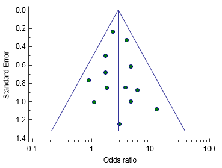
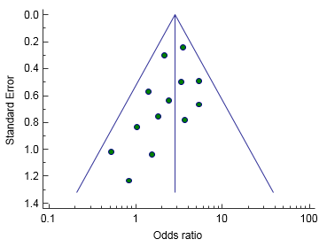

```{r setup, include=FALSE}
# R options
options(
  htmltools.dir.version = FALSE, # for blogdown
  show.signif.stars = FALSE,     # for regression output
  warm = 1
  )
# Set dpi and height for images
library(knitr)
knitr::opts_chunk$set(fig.height = 2.65, dpi = 300,fig.align='center',fig.show='hold',size='footnotesize', small.mar=TRUE) 
# For nonsese...
htmltools::tagList(rmarkdown::html_dependency_font_awesome())
```

```{r echo=FALSE, message=FALSE, warning=FALSE}
library(tidyverse)
library(rvest)
library(metafor)
library(readxl)
library(forestplot)
library(brms)
library(tidybayes)
```


## Meta-analysis

A .hlight[meta-analysis] is the "statistical analysis of a large collection of analysis results from individual studies for the purpose of integrating the findings" (Glass, 1976).

Meta-analysis is a standard tool for producing summaries of research findings in medicine and other fields.

Meta-analysis can be useful when studies yield potentially conflicting results, when sample sizes in individual studies are modest, when events are rare, and in general to summarize a literature.

Hierarchical models are often used as part of meta-analysis.


---
## Example: TB studies

For our first example, we examine the results of 13 studies evaluating the efficacy of a vaccine (BCG) for preventing tuberculosis.

You can [click here to see where the vaccine is given](http://www.bcgatlas.org). 

The vaccine is generally not recommended for use in the US due to low TB prevalence.

The data we will use in the .hlight[metafor] package.

This dataset has been used in several publications to illustrate meta-analytic methods.

See the documentation of the package for more details.


---
## Example: TB studies

The goal of the meta-analysis was to examine the overall effectiveness of the BCG vaccine for preventing tuberculosis and to examine moderators that may potentially influence the size of the effect.

The data actually comes in the form of a contingency table, so we will first compute our effectiveness measure from that.

Here, we focus on .hlight[log risk ratio] of tuberculosis infection in the **treated versus control** groups in 13 studies.

We can also use other measures, for example, .hlight[log odds ratio], if preferred.


---
## Example: TB studies

```{r}
#library(metafor)
data(dat.bcg)
dat.bcg
```


---
## Example: TB studies

```{r}
dat <- escalc(measure="RR", ai = tpos, bi = tneg, ci = cpos, di = cneg,
              data = dat.bcg, append = TRUE)
dat
```


---
## Forest plot of observed values

Note that `yi` represents the different effect sizes and `vi` gives the corresponding sampling variances.

```{r fig.height=4, eval=F}
res <- rma(yi, vi, data=dat, method="FE") #start with fixed effects
forest(res,
       slab = paste(dat$author, dat$year, sep = ", "),
       xlim = c(-16, 6), at = log(c(0.05, 0.25, 1, 4)),
       ilab = cbind(dat$tpos, dat$tneg, dat$cpos, dat$cneg), 
       ilab.xpos = c(-9.5, -8, -6, -4.5), cex = 0.75)
op <- par(cex = 0.75, font = 2)
text(c(-9.5, -8, -6, -4.5), 15, c("TB+", "TB-", "TB+", "TB-")) 
text(c(-8.75, -5.25), 16, c("Vaccinated", "Control"))
text(-16, 15, "Author(s) and Year", pos = 4)
text(6, 15, "Log Risk Ratio [95% CI]", pos = 2)
par(op)
```


---
## Forest plot of observed values

```{r fig.height=4.4, warning=F, echo=F}
res <- rma(yi, vi, data=dat,  method="FE")
forest(res,
       slab = paste(dat$author, dat$year, sep = ", "),
       xlim = c(-16, 6), at = log(c(0.05, 0.25, 1, 4)),
       ilab = cbind(dat$tpos, dat$tneg, dat$cpos, dat$cneg), 
       ilab.xpos = c(-9.5, -8, -6, -4.5), cex = 0.75)
op <- par(cex = 0.75, font = 2)
text(c(-9.5, -8, -6, -4.5), 15, c("TB+", "TB-", "TB+", "TB-")) 
text(c(-8.75, -5.25), 16, c("Vaccinated", "Control"))
text(-16, 15, "Author(s) and Year", pos = 4)
text(6, 15, "Log Risk Ratio [95% CI]", pos = 2)
par(op)
```

Most are below zero on the log scale and five of the confidence intervals include zero.


---
## Funnel plot

Funnel plots are scatter plots of each study's effect estimates against the precision of the estimates. 

Asymmetry can indicate publication bias.

  + Small, statistically insignificant studies are usually excluded from data





---
## Funnel plot

```{r fig.height=4.5, warning=F, echo=F}
funnel(res)
```

Maybe some bias but we also see larger than expected standard errors for 6 studies.


---
## Random effects meta-analysis

A random effects meta analysis typically assumes the model:
$$
\begin{split}
y_i & = \theta_i+e_i \\
\theta_i & = \mu+b_i \\
b_i & \sim N(0,\tau^2),
\end{split}
$$

where
  + $y_i$ is the effect estimate (possibly transformed) from study $i$,
  
  + $e_i \sim N(0,v_i)$ is the sampling error from study $i$ (the sampling variance $v_i$ estimated from each study is assumed known),
  
  + $\mu$ is the average "true" effect, and
  
  + $\tau^2$ is the heterogeneity among the study true effects.


---
## Random effects meta-analysis

In this framework, we may think of individual studies as:
  - replicates;
  
  - results from a variety of completely different studies of the same topic;
  
  - exchangeable yet not completely identical or unrelated.

Note the following:
  - $\mu$ is typically the primary quantity of interest as a summary measure across studies;
  
  - the error variance $v_i$ varies across studies and is often treated as known as the square of the standard error estimate from study $i$. 


---
## Example: spanking data

Kurz considers data on corporal punishment of children.

UNICEF (2014) reports that 80% of children worldwide are spanked or physically punished by their parents.

Spanking is one of the most studied (and controversial) aspects of parenting, and hundreds of studies are available on the topic.

The data [spank.xlsx](data/spank.xlsx) contain 111 summary measures of a variety of child behavioral, emotional, cognitive, and physical outcomes from studies.


---
## Example: spanking data

```{r readdata}
#library(readxl)
spank <- readxl::read_excel("data/spank.xlsx")
dim(spank)
head(spank)
length(unique(spank$outcome))
length(unique(spank$study))
```


---
## Example: spanking data

```{r}
unique(spank$outcome)
```


---
## Spanking data

The effect size of interest in the meta-analysis is the standardized difference in mean outcomes given by
$$d=\frac{\mu_{spanked}-\mu_{not spanked}}{\sigma_{pooled}},$$

where
$$\sigma_{pooled}=\sqrt{\frac{(n_1-1)\sigma_1^2+(n_2-1)\sigma_2^2}{n_1+n_2-2}}.$$

This effect size is just a mean difference converted to standard deviation units.

Most effect sizes will be fairly small -- for example, seeing an effect size of 1 would correspond to a 1 SD difference in the outcome between the spanking groups.

Let's peek at the full data in a forest plot.


---
## Spanking data


```{r forestplots2,warning=FALSE,message=FALSE,fig.height=4.4}
forestplot(rep(NA,length(spank$study)),spank$d,spank$ll,spank$ul,
           col = fpColors(lines="#990000", box="#660000", zero = "darkblue"))
```


---
## Spanking data

Note that the data on the previous slides do not provide us with standard errors for the effect sizes $d$; however, we can calculate them based on the CI's as
$$SE=\frac{\text{upper limit}-\text{lower limit}}{2\times 1.96}.$$

```{r spankse,warning=FALSE, message=FALSE}
#library(tidyverse)
spank <-
  spank %>% 
  mutate(se = (ul - ll) / (2*1.96))
glimpse(spank)
```


---
## Model

$$y_i=\theta_i+e_i~~~~\theta_i=\mu+b_i ~~~ b_i \sim N(0,\tau^2),$$

where
  + $y_i$ is the effect estimate (possibly transformed) from study $i$, and
  
  + $e_i \sim N(0,v_i)$ is the sampling error from study i (the sampling variance $v_i$ estimated from each study is assumed known).

We will go Bayesian in this example. Let's put a
  + $\text{Half-Cauchy}(0,1)$ prior on $\tau$ and
  + $N(0,1)$ prior on $\mu$
as it would be really rare to have a summary $d$ that was very big on the effect size scale -- probably not the case for spanking but maybe if we were measuring more severe physical abuse.


---
## Model

```{r spankmodel,cache=TRUE,warning=FALSE,message=FALSE}
#library(brms)
m.spank <- 
  brm(data = spank, family = gaussian,
      d | se(se) ~ 1 + (1 | study),
      prior = c(prior(normal(0, 1), class = Intercept),
                prior(cauchy(0, 1), class = sd)),
      iter = 4000, warmup = 1000, cores = 4, chains = 4,
      seed = 123, control = list(adapt_delta = 0.95))
```


---
## Results

```{r brmsm1,message=FALSE,warning=FALSE}
print(m.spank)
```


---
## Results

Our summary measure for $d$ is 0.38, with 95% CrI=(0.31,0.45). Kids who were spanked had on average scores 0.38 SD higher than kids who were not spanked.

These outcomes were coded by authors in the same direction, so that larger values of $d$ imply more negative outcomes among kids who were spanked.

**Note:** presumably many of these studies are not randomized, and this association does not imply causation.


---
## Multiple outcomes

One interesting aspect of the data is while we have 111 outcome effect sizes, these come from only 76 separate studies -- some studies measured multiple outcomes.

```{r summary}
spank %>% 
  distinct(study) %>% 
  count()
```

We may wish to shrink outcomes of similar types together -- so let's fit a cross-classified random effects model by adding a random effect for outcome type.


---
## Updated model

```{r reoutcome,cache=TRUE,warning=FALSE,message=FALSE}
m.spank.outcome <- 
  brm(data = spank, family = gaussian,
      d | se(se) ~ 1 + (1 | study) + (1 | outcome),
      prior = c(prior(normal(0, 1), class = Intercept),
                prior(cauchy(0, 1), class = sd)),
      iter = 4000, warmup = 1000, cores = 4, chains = 4,
      seed = 123, control = list(adapt_delta = 0.95))
```


---
## Updated results

.small[
```{r spankoutcomeredux}
print(m.spank.outcome)
```
]

The estimates of $d$ are quite similar to our previous ones. Looking at the variance components, the study-to-study heterogeneity is larger than heterogeneity across outcomes. We can explore further in a figure. 


---
## Updated results

```{r plotredists,eval=FALSE}
# we'll want this to label the plot
label <-
  tibble(tau   = c(.12, .3),
         y     = c(15, 10),
         label = c("sigma['outcome']", "sigma['study']"))

# wrangle
posterior_samples(m.spank.outcome) %>% 
  select(starts_with("sd")) %>% 
  gather(key, tau) %>% 
  mutate(key = str_remove(key, "sd_") %>% str_remove(., "__Intercept")) %>% 
  
  # plot
  ggplot(aes(x = tau)) +
  geom_density(aes(fill = key),
               color = "transparent") +
  geom_text(data = label,
            aes(y = y, label = label, color = label),
            parse = T, size = 5) +
  scale_fill_viridis_d(NULL, option = "B", begin = .5) +
  scale_color_viridis_d(NULL, option = "B", begin = .5) +
  scale_y_continuous(NULL, breaks = NULL) +
  xlab(expression(tau)) +
  theme(panel.grid = element_blank())
```


---
## Updated results

```{r plotredists2,echo=FALSE,warning=FALSE,message=FALSE, fig.height=4}
# we'll want this to label the plot
label <-
  tibble(tau   = c(.12, .3),
         y     = c(15, 10),
         label = c("sigma['outcome']", "sigma['study']"))

# wrangle
posterior_samples(m.spank.outcome) %>% 
  select(starts_with("sd")) %>% 
  gather(key, tau) %>% 
  mutate(key = str_remove(key, "sd_") %>% str_remove(., "__Intercept")) %>% 
  
  # plot
  ggplot(aes(x = tau)) +
  geom_density(aes(fill = key),
               color = "transparent") +
  geom_text(data = label,
            aes(y = y, label = label, color = label),
            parse = T, size = 5) +
  scale_fill_viridis_d(NULL, option = "C", begin = .5) +
  scale_color_viridis_d(NULL, option = "C", begin = .5) +
  scale_y_continuous(NULL, breaks = NULL) +
  xlab(expression(tau)) +
  theme(panel.grid = element_blank())
```


---
## Updated results

We can also check whether spanking has similar effects on all the different outcomes -- let's examine those more closely.

```{r outcomes3,eval=FALSE}
#library(tidybayes)
m.spank.outcome %>% 
  spread_draws(b_Intercept, r_outcome[outcome,]) %>%
  # add the grand mean to the group-specific deviations
  mutate(mu = b_Intercept + r_outcome) %>%
  ungroup() %>%
  mutate(outcome = str_replace_all(outcome, "[.]", " ")) %>% 

  # plot
  ggplot(aes(x = mu, y = reorder(outcome, mu),
             fill = reorder(outcome, mu))) +
  geom_vline(xintercept = fixef(m.spank.outcome)[1, 1],
             color = "grey33", size = 1) +
  geom_vline(xintercept = fixef(m.spank.outcome)[1, 3:4],
             color = "grey33", linetype = 2) +
  geom_halfeyeh(.width = .95, size = 2/3, color = "white") +
  scale_fill_viridis_d(option = "B", begin = .2) +
  labs(x = expression(italic("Cohen's d")),
       y = NULL) +
  theme(panel.grid   = element_blank(),
        axis.ticks.y = element_blank(),
        axis.text.y  = element_text(hjust = 0))
```


---
## Updated results

```{r outcomes4,echo=FALSE,message=FALSE,warning=FALSE, fig.height=4}
m.spank.outcome %>% 
  spread_draws(b_Intercept, r_outcome[outcome,]) %>%
  # add the grand mean to the group-specific deviations
  mutate(mu = b_Intercept + r_outcome) %>%
  ungroup() %>%
  mutate(outcome = str_replace_all(outcome, "[.]", " ")) %>% 

  # plot
  ggplot(aes(x = mu, y = reorder(outcome, mu), fill = reorder(outcome, mu))) +
  geom_vline(xintercept = fixef(m.spank.outcome)[1, 1], color = "grey33", size = 1) +
  geom_vline(xintercept = fixef(m.spank.outcome)[1, 3:4], color = "grey33", linetype = 2) +
  geom_halfeyeh(.width = .95, size = 2/3, color = "white") +
  scale_fill_viridis_d(option = "B", begin = .2) +
  labs(x = expression(italic("Cohen's d")),
       y = NULL) +
  theme(panel.grid   = element_blank(),
        axis.ticks.y = element_blank(),
        axis.text.y  = element_text(hjust = 0))
```


We see evidence that spanking may be particularly linked with child externalizing behavior problems (again, this is chicken & egg -- we cannot infer causation).


---
## Example: bladder cancer

There are many other interesting variations of this standard random effects model.

For example, we may want to assign weights to the studies, especially when we do not have that many studies to work with, and we think the studies vary in quality.

In our next example, we have results from seven studies about the effect of chlorinated water on the odds ratio of getting bladder cancer.

Five studies investigated a sample cancer deaths, while two studies looked at cancer diagnoses.

There is likely natural (or maybe systematic) variability across these studies.


---
## Example: bladder cancer

Again, the goal is to combine the results of these studies to estimate the "true" overall effect, incorporating information about the quality of study and uncertainty of estimates of effect size.

```{r echo=FALSE, results='asis'}
Author <- c("Cantor","Zierler","Wilkins","Gottlieb","Brenniman", "Young", "Alvanja")
Year <- c(1987, 1988, 1986, 1982, 1980, 1981, 1978)
AdjOR <- c(1.19, 1.60, 2.20, 1.18, .98, 1.15, 1.69)
LCL <- c(1.07, 1.2, .71, .95, .77, .7, 1.07)
UCL <- c(1.32, 2.10, 6.82, 1.45, 1.25, 1.89, 2.67)
Method <- c("Logistic", "M-H", "Logistic", "Adj", "Adj", "Logistic", "Adj")
Quality <- c(78, 71, 61, 49, 46, 45, 43)
Meta_data <- data.frame(Author, Year, AdjOR, LCL, UCL, Method, Quality)

knitr::kable(Meta_data)
```


---
## Example: bladder cancer

```{r results='asis'}
author <- c("Cantor","Zierler","Wilkins","Gottlieb","Brenniman", "Young", "Alvanja")
year <- c(1987, 1988, 1986, 1982, 1980, 1981, 1978)
adjOR <- c(1.19, 1.60, 2.20, 1.18, .98, 1.15, 1.69)
LCL <- c(1.07, 1.2, .71, .95, .77, .7, 1.07)
UCL <- c(1.32, 2.10, 6.82, 1.45, 1.25, 1.89, 2.67)
method <- c("Logistic", "M-H", "Logistic", "Adj", "Adj", "Logistic", "Adj")
quality <- c(78, 71, 61, 49, 46, 45, 43)

meta <- data.frame(author, year, adjOR, LCL, UCL, method, quality)

#convert to log odds ratio so we can use a linear mixed effects model
meta$LN_adjOR <- round(log(meta$adjOR),2)

#also get the standard error on the log odds ratio scale
meta$SE_LNadjOR <- round((log(meta$UCL) - log(meta$adjOR))/1.96,2)
```


---
## Example: bladder cancer

Note: M-H is the Mantel-Haenszel method, which produces and approximate logistic regression estimate.

The odds ratio was adjusted by some method other than logistic regression.

Each paper was rated for quality on the basis of selection of subjects, measurement of and adjustment for confounding variables, exposure assessment, and statistical analysis. 

Interpret the score as the percentage of quality.

Easy to think about weighting each study using a function of its quality rating.


---
## Forest plot

```{r fig.height=3.4, warning=F}
forest(x=meta$LN_adjOR, sei=meta$SE_LNadjOR, slab=meta$author, top=0.5,
       xlab="Log Adjusted Odds Ratio")
```

All log-odds ratio estimates are above zero, with the exception of Brenniman.

Four of the seven confidence intervals include zero.


---
## Funnel plot

```{r fig.height=4.2, warning=F, echo=F}
#library(metafor); funnel plots require fitting a fixed effects model to the data
meta_fit0 <- rma(yi=LN_adjOR, sei = SE_LNadjOR, data=meta, measure="OR", method="FE")
funnel(meta_fit0, yaxis="sei",xlab="Log Adjusted Odds Ratio")
```

No immediate publication bias seems evident in the data. Difficult to determine asymmetry in the plot because there are only seven studies.


---
## Random effects model with weights

Suppose
  + $y_i$ is the log odds ratio for study $i$, and
  + $w_i$ is the weight given to study $i$.

Then we can fit the following model
$$
\begin{split}
y_i & = \theta_i+e_i; \ \ \ \theta_i = \mu+b_i \\
b_i & \sim N(0,\tau^2);  \ \ \ e_i \sim N(0,v_i),
\end{split}
$$

and estimate the overall effect as
$$\hat{\mu} = \frac{\sum_i w_i y_i}{\sum_i w_i}; \ \ \ \text{ with } \ \ Var(\hat{\mu}) = \frac{\sum_i w_i^2 Var(y_i)}{(\sum_i w_i)^2}.$$


---
## Some options for the weights

The weights should obviously be related to the model but how should we specify them? Here are some common options:

+ Option I: $w_i = \frac{1}{\tau^2 + v_i}$
    - Each study is weighted by the sample variance with more weight on studies with lower variance

+ Option II: $w_i = Q_i$
    - Each study is weighted by quality with more weight on studies with higher quality.

+ Option III: $w_i = \frac{\hat{Q}_i}{\tau_i^2 + v_i}$
    - $\hat{Q}_i$ is a modified quality measure, with more weight on studies with high quality and low variance

The variances are estimated from the random effects model. Note: the second option does not require any model.


---
## Quality effects model for meta-analysis

Option III incorporates quality by adjusting the weight as well as redistributing weights based on quality. (Doi, Thalib, 2009).

Note: 
  + $Q_i$ is quality of study $i$
  + $N$ is total number of studies.
  
Then, we have
$$
\begin{split}
w_i & = \frac{1}{\tau^2 + v_i^2} \quad \quad \tau_i = \frac{w_i - (w_i \cdot Q_i)}{N-1}\\
\hat{\tau}_i & = \sum_i \tau_i - \tau_i \quad \textit{is a quality adjustor} \\
\hat{Q}_i & = Q_i + \frac{\hat{\tau_i}}{w_i} \quad \textit{is the modified quality}.
\end{split}
$$


---
## Final comments

Easy to implement all three options, especially using the .hlight[metafor] package.

This is a very short introduction to meta-analysis in R but is as much as we are going to cover.

The .hlight[metafor] package allows for many kinds of models for meta-analysis.

When fitting Bayesian version, also use the .hlight[brms] package as always.

For a much more detailed material on meta-analysis (both classicial and Bayesian), see [this very wonderful hands-on guide!](https://bookdown.org/MathiasHarrer/Doing_Meta_Analysis_in_R/)

Also, take a look at Section 15.5 of [A. Solomon Kurz's statistical rethinking ebook](https://bookdown.org/content/4857/).


---

class: center, middle

# What's next?

### Move on to the readings for the next module!


