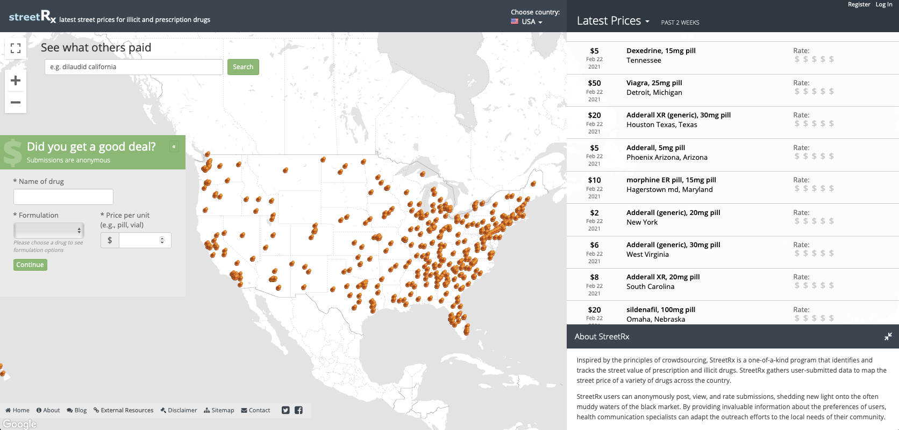

```{r include=FALSE}
library(tidyverse)
library(tufte)
library(knitr)
options(
  htmltools.dir.version = FALSE, # for blogdown
  show.signif.stars = FALSE,     # for regression output
  digits = 2
  )
#knitr::opts_chunk$set(eval = FALSE)
#knitr::opts_chunk$set(fig.height = 2.65, dpi = 300,fig.align='center',fig.show='hold',size='footnotesize', small.mar=TRUE) 
knitr::opts_chunk$set(dpi = 72,fig.align='center',fig.show='hold') 
```

## Due dates

- In-class presentations: 1:45 - 3:00pm, Monday, October 11.
- Final reports: 11:59pm, Sunday, October 17.
- Evaluation of team members: 11:59pm, Monday, October 18.


## General instructions
### Team work
You MUST work within your assigned teams.

- <font color="red">Each team member must work on understanding the data, exploring the data, building the models and providing answers to the questions of interest. This should be the focus of your team meetings.</font>
- The other responsibilities must be divided according to the following designations:
  + <font color="green">Checker:</font> Double-checks the work for reproducibility and errors. Also responsible for submitting the report and presentation files.
  + <font color="green">Coordinator:</font> Keeps everyone on task and makes sure everyone is involved. Also responsible for coordinating team meetings and defining the objectives for each meeting.
  + <font color="green">Presenter:</font> Primarily responsible for organizing and putting the team presentations together.
  + <font color="green">Programmer:</font> Primarily responsible for all things coding. The programmer is responsible for putting everyone's code together and making sure the final product is "readable".
  + <font color="green">Writer:</font> Primarily responsible for putting together the final report.
- <font color="red">Four-person teams should combine the roles of checker and coordinator into a single role. Three-person teams should combine the roles of checker and writer into a single role, and the roles of coordinator and presenter into a single role.</font>


### Presentations
<font color="red">Each team will have 7 minutes to present their findings in class. Feel free to get creative with the presentations; fun animations are welcome!</font>

  + The presentation should cover a brief introduction, a detailed presentation of your model, and your most interesting and important findings. At least one EDA plot must be included.
  + If you choose to use presentation slides, you should create them with the time limit in mind. You should consider making between 6 and 8 slides (excluding the title slide), so that you have approximately one minute to get through each one. You are free to create your presentation slides using PowerPoint, LaTeX or any other application you choose.
  + The order of the in-class presentations will be randomized; each team is expected to come to class fully prepared to present first.
  + Also, each team should come to class prepared to answer questions from the instructor and other students. 
  +  <font color="red">Each team's presentation files must be submitted on Sakai by 9:00am on Monday, October 11. The checker should upload the files to their Dropbox folder on Sakai.</font> 


### Reports
Each team MUST turn in only one report with team members' names at the top of the report, and the different designations (checker, coordinator, presenter, programmer, and writer).

  + Please limit your write-up to 8 pages in total (in 11 point font or larger). <font color="red">You will be penalized should your combined report exceed 8 pages!</font>
  + Your write-up should specify
the statistical model used, including the data model and prior distributions (if relevant), in addition to
communicating your analysis findings.
  + Please type your reports using R Markdown or LaTeX and be sure to knit or convert the final output file to `.pdf`. 
  + <font color="red">**DO NOT INCLUDE R CODE OR OUTPUT IN YOUR SOLUTIONS/REPORTS** *R outputs should be converted to nicely formatted tables. Feel free to use R packages such as `kable`, `xtable`, `stargazer`, etc.*</font>
  + All R-code must be included in the appendix. Feel free to also include any supplemental material that is important for your analysis, such as diagnostic checks or exploratory plots that you feel justify the conclusions in your report.
  + All reports must be submitted on Gradescope: go to Assignments $\rightarrow$ Case Study I Reports. Gradescope will let you select your team mates when submitting, so make sure to do so. The checker is responsible for submitting the report.
  


### Evaluations
<font color="red">All team members must complete a very short written evaluation, quickly describing the effort put forth by other team members.</font>

  + The evaluation should include a list of all other team members (not including you) and considering all the work on the assignment that was not done by you, a breakdown of the fraction of work done by each other team member. For example, if you are on a 4 person team and the other team members all contributed equally, you would assign the fraction 1/3 to each of them (regardless of whether you all did 1/4 of the work overall, or whether you personally did half the work and the others each did 1/6).
  + In the case you feel one or more team members deserves a different grade on the assignment than the others, you should provide a description of why that member or members deserves a different grade. (In this case you can talk about your own relative contribution.)
  + Submit on Gradescope: go to Assignments $\rightarrow$ Case Study I Evaluations.


## Analysis




### Introduction

In this case study, we consider data provided by StreetRx. From their website,

*StreetRx (streetrx.com) is a web-based citizen reporting tool enabling real-time collection of street price data on diverted pharmaceutical substances. Based on principles of crowdsourcing for public health surveillance, the site allows users to anonymously report prices they paid or heard were paid for diverted prescription drugs. User-generated data offers intelligence into an otherwise opaque black market, providing a novel data set for public health surveillance, specifically for controlled substances.*

*Prescription opioid diversion and abuse are major public health issues, and street prices provide an indicator of drug availability, demand, and abuse potential. Such data, however, can be difficult to collect and crowdsourcing can provide an effective solution in an era of Internet-based social networks. Data derived from StreetRx generates valuable insights for pharmacoepidemiological research, health-policy analysis, pharmacy-economic modeling, and in assisting epidemiologists and policymakers in understanding the effects of product formulations and pricing structures on the diversion of prescription drugs.*

*StreetRx operates under strong partnership with the Researched Abuse, Diversion, and Addiction-Related Surveillance System (RADARS), a surveillance system that collects product- and geographically-specific data on abuse, misuse, and diversion of prescription drugs. The site was launched in the United States in November 2010. Since then, there have been over 300,000 reports of diverted drug prices. StreetRx has expanded into Australia, Canada, France, Germany, Italy, Spain, and the United Kingdom.*

### Data

<font color="red">**This data is NOT to be shared outside of class and specifically, NOT to be shared beyond this case study.**</font>

The data can be found on Sakai. The file `streetrx.RData` contains the actual data, and the instructions plus data dictionary (also given below) can be found in the file `StreetRx Data Dictionary and Instructions_1q19.docx`. The grading rubric can be found in the file `rubriccasestudy.doc`; we will use the rubric for both case studies.

Each team has been assigned a different drug or drug family for investigation as given below. Subset the data and only focus on the drug or drug family assigned to your team.

Team      | Drug
:------------- | :------------ 
Group 1 | Methadone
Group 2 | Codeine
Group 3 | Morphine
Group 4 | Oxymorphone
Group 5 | Diazepam
Group 6 | Lorazepam
Group 7 | Tramadol

Variables provided to us by StreetRx include the following.

Variable       | Description
:------------- | :------------ 
ppm | Price per mg (outcome of interest)
yq_pdate | Year and quarter drug was purchased (format YYYYQ, so a purchase in March 2019 would be coded 20191)
price_date | Date of the reported purchase (MM/DD/YY) (a finer-grained time variable than yq_pdate)
city | manually entered by user and not required
state | manually entered by user and not required
country | manually entered by user and not required
USA_region | based on state and coded as northeast, midwest, west, south, or other/unknown
source | source of information; allows users to report purchases they did not personally make
api_temp | active ingredient of drug of interest (you will subset to values of api_temp provided to your team above)
form_temp | this variable reports the formulation of the drug (e.g., pill, patch, suppository)
mgstr | dosage strength in mg of the units purchased (so ppm*mgstr is the total price paid per unit)
bulk_purchase | indicator for purchase of 10+ units at once
primary_reason | data collection for this variable began in the 4th quarter of 2016. Values include: <br /> 0 = Reporter did not answer the question <br />  1 = To treat a medical condition (ADHD, excessive sleepiness, etc.) <br />  2 = To help me perform better at work, school, or other task <br /> 3 = To prevent or treat withdrawal <br /> 4 = For enjoyment/to get high <br /> 5 = To resell <br /> 6 = Other reason <br /> 7 = Don’t know <br /> 8 = Prefer not to answer <br />  9 = To self-treat my pain <br /> 10 = To treat a medical condition other than pain <br /> 11 = To come down <br /> 12 = To treat a medical condition (anxiety, difficulty sleeping, etc.)


### Questions of interest

Your job is to investigate factors related to the price per mg of your drug, accounting for potential clustering by location and exploring heterogeneity in pricing by location.

As part of your analysis, explore how the factors provided are, or are not, associated with pricing per milligram. One challenge with StreetRx data is that they are entered by users, so do bear in mind that exploratory data analysis will be important in terms of identifying unreasonable observations, given that website users may not always be truthful (e.g., I could go on the website now and say I paid a million dollars for one Xanax on the island of Aitutaki, and that would be reflected in the database).

Be sure to also include the following in your report: 

- the final models you ultimately decided to use,
- clear model building, that is, justification for the models (e.g., why you chose certain transformations and why you decided the final models are reasonable),
- model assessment for the final models,
- the relevant model outputs (table of coefficients with SEs and/or confidence intervals, etc),
- your interpretation of the results in the context of the questions of interest, including clear and direct answers to the questions posed, and
- any potential limitations of the analyses.

<font color="red">Finally, your analysis MUST address the questions of interest directly.</font> 


## Grading

100 points.


