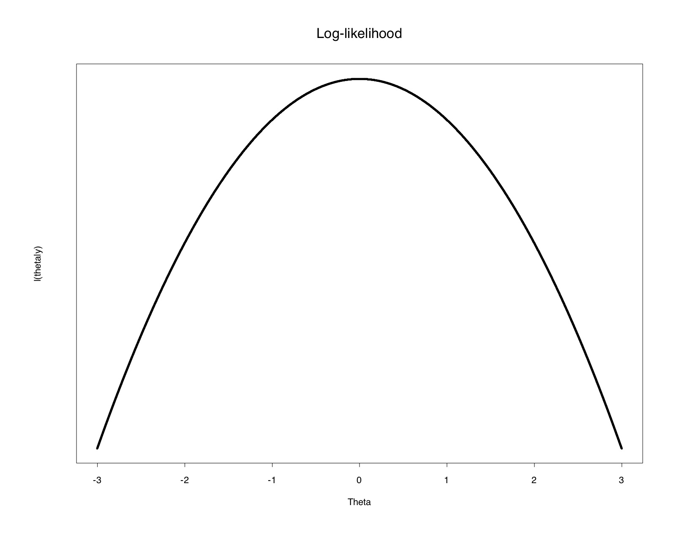

```{r setup, include=FALSE}
# R options
options(
  htmltools.dir.version = FALSE, # for blogdown
  show.signif.stars = FALSE,     # for regression output
  warm = 1
  )
# Set dpi and height for images
library(knitr)
knitr::opts_chunk$set(fig.height = 2.65, dpi = 300,fig.align='center',fig.show='hold',size='footnotesize', small.mar=TRUE) 
# For nonsese...
htmltools::tagList(rmarkdown::html_dependency_font_awesome())
```

```{r echo=FALSE, message=FALSE, warning=FALSE}
#library(tidyverse)
#library(rvest)
```


## Maximum likelihood estimators

*Maximum likelihood estimates* (MLE's) have excellent large-sample properties and are applicable in a wide variety of situations.  

Examples of maximum likelihood estimates include the following:

  - The sample average $\bar{X}$ of a group of independent and identically normally distributed observations $X_1, \ldots, X_n$ is a maximum likelihood estimate.

  - Parameter estimates in a linear regression model fit to normally distributed data are maximum likelihood estimates.

  - Parameter estimates in a logistic regression model are maximum likelihood estimates.


---
## Maximum likelihood estimators

  - The estimate $s^2=\frac{\sum_{i=1}^n (x_i-\overline{x})^2}{n-1}$ of the variance of a group of independent and identically normally distributed observations is **not** a maximum likelihood estimate.  (The MLE of the variance is $\left(\frac{n-1}{n}\right)s^2$.)


---
## Finding the MLE

Let $L(\theta \mid {\bf Y})$ denote the likelihood function for data ${\bf Y}=(Y_1,Y_2,\ldots,Y_n)$ from some population described by the parameters $\theta=(\theta_1,\theta_2,\ldots,\theta_p)$.  


The maximum likelihood estimate of $\theta$ is given by the estimator $\widehat{\theta}=(\widehat{\theta}_1,\widehat{\theta}_2,\ldots, \widehat{\theta}_p)$ for which
$$L(\widehat{\theta} \mid {\bf Y}) > L(\theta^* \mid {\bf Y}),$$ where $\theta^*$ is any other estimate of $\theta$.  


Thus the maximum likelihood estimate is the most "probable" or "likely" given the data.


---
## Finding the MLE

Maximizing the likelihood $L(\theta \mid {\bf Y})$ is equivalent to maximizing the natural logarithm $\ln(L(\theta \mid {\bf Y}))=\ell(\theta \mid {\bf Y})$, called the log-likelihood.  The maximum likelihood estimates are typically found as the solutions of the $p$ equations obtained by setting the $p$ partial derivatives of $\ell(\theta \mid {\bf Y})$ with respect to each $\theta_j$, $j=1,\ldots,p$, equal to zero.


---
## Finding the MLE

Why do we solve the derivatives for zero?  The derivative gives us the slope of the likelihood (or log-likelihood), and when the slope is zero, we know that we are at either a local minimum or local maximum.  (The second derivative is negative for a maximum and positive for a minimum.)


```{r echo=FALSE, out.height="400px",out.width="550px"}

```


---
## Finding the MLE

When closed form expressions for maximum likelihood estimates do not exist, computer algorithms may be used to solve for the estimates.

Example:  Let $Y_i$, $i=1, \ldots, n$ be iid normal random variables with mean $\mu$ and variance $\sigma^2$, so $Y_i \sim N(\mu,\sigma^2)$, $i=1,\ldots,n$.  

$\text{The density of } Y_i \text{ is given by }$

\begin{eqnarray*}
f(Y_i \mid \mu, \sigma^2)=(2 \pi)^{-\frac{1}{2}}( \sigma^2)^{-\frac{1}{2}} \exp \left\{-\frac{1}{2 \sigma^2}(Y_i-\mu)^2 \right\}.
\end{eqnarray*}

Find the maximum likelihood estimates of $\mu$ and $\sigma^2$.


---
## Hypothesis testing and interval estimation with MLE's

It can be shown (based on large-sample properties of MLE's) that
\begin{equation*}
\frac{\widehat{\beta}_1 - \beta_1}{\sqrt{\widehat{\text{Var}}(\widehat{\beta}_1)}}
\end{equation*}
is approximately $N(0,1)$ when the sample size is large.

A test of $H_0: \beta_1=0$ versus $H_A: \beta_1 \ne 0$ can be based on the $Z$ statistic $\frac{\widehat{\beta}_1}{\sqrt{\widehat{\text{Var}}(\widehat{\beta}_1)}}$, which has approximately a $N(0,1)$ distribution under $H_0$.  

This test is called a *Wald test*.


---
## Hypothesis testing and interval estimation with MLE's

By a similar argument, an approximate $100(1-\alpha)\%$ large-sample confidence interval for $\beta_1$ takes the form
\begin{equation*}
\widehat{\beta}_1 \pm Z_{1-\frac{\alpha}{2}} \sqrt{\widehat{\text{Var}}(\widehat{\beta}_1)},
\end{equation*}
where $Pr(Z > Z_{1-\frac{\alpha}{2}})=\frac{\alpha}{2}$ when $Z \sim N(0,1)$.

**NOTE:**  Testing $\sigma^2$ is more complicated, and the Wald test for the hypothesis $\sigma^2=0$ is not recommended because the value $\sigma^2=0$ is on the boundary of the parameter space for $\sigma^2$, a violation of a regularity condition for the validity of the test.


---

class: center, middle

# What's next? 

### Move on to the readings for the next module!


