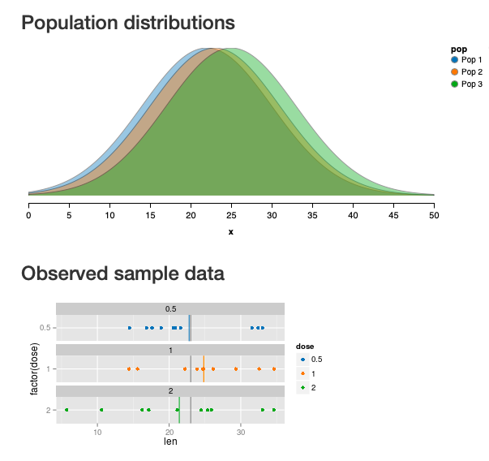
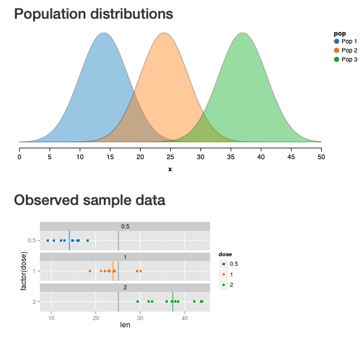

```{r setup, include=FALSE}
# R options
options(
  htmltools.dir.version = FALSE, # for blogdown
  show.signif.stars = FALSE,     # for regression output
  warm = 1
  )
# Set dpi and height for images
library(knitr)
knitr::opts_chunk$set(fig.height = 2.65, dpi = 300,fig.align='center',fig.show='hold',size='footnotesize', small.mar=TRUE) 
# For nonsese...
htmltools::tagList(rmarkdown::html_dependency_font_awesome())
```

```{r echo=FALSE, message=FALSE, warning=FALSE}
library(tidyverse)
library(rvest)
library(ggplot2)
```


## Motivating Example: Cycling Safety

To understand how many complex hierarchical models work, we will need to take a step back and start small, specifically, with ANOVA models.

Dr. Ian Walker at University of Bath carried out a project to investigate how drivers overtake bicyclists.

His team modified a bicycle subtly to carry both a video system and an accurate ultrasonic distance sensor that could record the proximities of each passing vehicle.

The team then designed an experiment in which a cyclist (Dr. Walker) varied the distance he rode from the curb (the British spelling kerb is used in the dataset) from 0.25m to 1.25m in 0.25 m increments. 


---
## Motivating Example: Cycling Safety

We will consider the outcome of passing distance $y_{ij}$, which is the measured distance (in $m$) between the vehicle and the cyclist, as a function of the distance from the bike to the curb (indexed by $j$), as some cyclists have postulated that ["the more room you take up, the more room they give you."](https://www.hotels-in-netherlands.com/bikereadercom/contributors/misc/big.html)

We'll use these  data to test this "Theory of Big."

Our research question of interest is whether the distance from the bike to the curb is indeed related to the passing distance between the bike and a vehicle.

The data is in the .hlight[PsychBikeData.RData] file on Sakai.


---
## EDA

```{r}
load("data/PsychBikeData.RData")
PsychBikeData$kerb <- as.factor(PsychBikeData$kerb)
dim(PsychBikeData)
head(PsychBikeData)
```


---
## EDA

```{r}
str(PsychBikeData)
```


---
## EDA

.large[
```{r}
summary(PsychBikeData)
```
]


---
## EDA

```{r fig.height=4}
ggplot(PsychBikeData,aes(`passing distance`)) +
  geom_histogram(fill="lightblue4",bins=20) + theme(legend.position="none") +
  labs(title="Distribution of Passing Distance",x="Passing Distance (m)") +
  theme_classic()
```


---
## EDA

```{r fig.height=3.4}
ggplot(PsychBikeData,aes(`passing distance`)) +
  geom_histogram(aes(y=..density..),color="black",linetype="dashed",
                 fill=rainbow(15),bins=15) + theme(legend.position="none") +
  geom_density(alpha=.25, fill="lightblue") + scale_fill_brewer(palette="Blues") +
  labs(title="Distribution of Passing Distance",x="Passing Distance (m)") +
  theme_classic()
```


---
## EDA


```{r fig.height=3.4}
ggplot(PsychBikeData,aes(y=`passing distance`, x=kerb, fill=kerb)) +
  geom_boxplot(outlier.colour = "red", outlier.shape = 1) + 
  scale_fill_brewer(palette="Greens") +
  labs(x="Distance from Curb (m)", y = "Passing Distance (m)") + 
   theme_classic() + theme(legend.position="none")
```

Research question: is distance from curb related to passing distance?


---
## EDA

``` {r}
table(PsychBikeData$kerb)
tapply(PsychBikeData$`passing distance`,PsychBikeData$kerb,mean)
```


---
## ANOVA Model

Consider the model

\begin{eqnarray*}
y_{ij}&=&\mu+\alpha_j+\varepsilon_{ij} \text{ (treatment effects model)} \\
&=& \mu_j + \varepsilon_{ij} ~~~~~~~\text{         (treatment means model)}
\end{eqnarray*}
where $\mu_{j}=\mu+\alpha_j$.

These two equations are simply alternate parameterizations of the same model. 

In each case, we estimate a separate mean passing distance $\mu_j=\mu+\alpha_j$ as a function of each of the 5 curb distances tested.


---
## ANOVA Model

\begin{eqnarray*}
y_{ij}&=&\mu+\alpha_j+\varepsilon_{ij}=\mu_j + \varepsilon_{ij}
\end{eqnarray*}

  - $\mu$: expected passing distance (grand mean).
  
  - $\mu_j$: expected passing distance for curb distance $j$, with $j = 1,\ldots,J=5$.
  
  - $\alpha_j$: deviation between overall expected passing distance and expected passing distance for curb distance $j$.
  
  - $\varepsilon_{ij}$: deviations of observed passing distance from curb-distance-specific expectations.
  
  - In the standard ANOVA model  $\sum_j \alpha_j = 0$ is assumed so that $\mu$ represents an overall mean across groups.  
  
  - Another .hlight[coding scheme]: set one $\alpha_j=0$ so that $\mu$ represents the expected passing distance in that particular group, and remaining $\alpha_j$ measure differences from expected passing distance in that .hlight[reference group].


---
## ANOVA Model

We also assume that $\varepsilon_{ij} \overset{iid}{\sim} f(\varepsilon)$ with $\mathbb{E}(\varepsilon_{ij})=0$ within all groups $j$.

The expected passing distance for occasion $i$ in with curb distance $j$ is then

$$
\begin{split}
\mathbb{E}(y_{ij} \mid \mu, \alpha_1, \cdots, \alpha_J) & = \mathbb{E}(\mu+\alpha_j+\varepsilon_{ij} \mid \mu, \alpha_1, \cdots, \alpha_J) \\
& =\mu+\alpha_j\\
& =\mu_j
\end{split}
$$


If we assume $f(\varepsilon)=N\left(0,\sigma^2\right)$, then our model is $y_{ij} \sim N\left(\mu+\alpha_j,\sigma^2\right)$ or equivalently $y_{ij} \sim N\left(\mu_j,\sigma^2\right)$.


---
## Parameter estimation

Let $\widehat{\mu}=\left(\widehat{\mu}_1,\cdots,\widehat{\mu}_J\right)$ be our estimates of the unknown parameters $\mu=(\mu_1,\cdots,\mu_J)$. 

The .hlight[residual] for $y_{ij}$ is the difference between the observed $y_{ij}$ and our fitted value $\widehat{y}_{ij}$  and is given by
$$\widehat{\varepsilon}_{ij}=y_{ij}-\widehat{y}_{ij}=y_{ij}-\widehat{\mu}_{j}.$$


The ordinary least squares (OLS) estimate of $\mu$, $\widehat{\mu}_{OLS}$, is the value that minimizes the sum of squared residuals (sum of squared errors) given by 

$$SSE(\mu)=\sum_j \sum_i (y_{ij}-\mu_j)^2.$$


---
## OLS Estimates

You can show (homework!) that the OLS estimates are given by

  - $(\widehat{\mu}_1,\cdots,\widehat{\mu}_J)=(\overline{y}_1,\cdots,\overline{y}_J)$, where $\overline{y}_j$ is the sample mean in group $j$.

  - $\widehat{\mu}=\overline{y}$, where $\overline{y}$ is the grand mean over all observations.
    
  - $\widehat{\mu}=\frac{1}{J}\sum_j \widehat{\mu}_j$ when the sample sizes in each group j, $n_j$, are equal for all groups.
    
  - $\widehat{\alpha}_j=\widehat{\mu}_j-\widehat{\mu}=\overline{y}_{j}-\overline{y}$.

A helpful mnemonic may be the following "decomposition" of a single data point:

\begin{eqnarray*}
y_{ij}&=& y_{ij} + \overline{y}_{j} - \overline{y}_{j} + \overline{y} - \overline{y} \\
&=& \overline{y} + (\overline{y}_{j}-\overline{y}) + (y_{ij}-\overline{y}_{j}) \\
&=& \widehat{\mu} ~~ + ~~~~~\widehat{\alpha}_j ~~~~~ + ~~~~~ \widehat{\varepsilon}_{ij}
\end{eqnarray*}


---
## Sums of Squares

Based on those ideas, we can decompose the variability of the data around the grand mean into variation within groups (error) and variation between or across groups (group effects).

For simplicity, suppose we have $J$ groups with $n_j$ observations in each group. 

We break down the total variation of the data around the overall mean as follows:  $$SST=SSG+SSE,$$ where
  + SST is the total sum of squared deviations around the overall mean,
  + SSG is the portion of the total sum of squares due to group differences, and 
  + SSE is the portion of the total sum of squares due to differences between the individual observations and their own group means.


---
## Sums of Squares

We define the sums of squares as follows:

  - $\text{SST}=\sum\limits_{j=1}^J \sum\limits_{i=1}^{n_j} \left(y_{ij}-\overline{y}\right)^2$
  
  - $\text{SSG}=\sum\limits_{j=1}^J \sum\limits_{i=1}^{n_j} \left(\overline{y}_{j}-\overline{y}\right)^2$
  
  - $\text{SSE}= \sum\limits_{j=1}^J \sum\limits_{i=1}^{n_j} \left(y_{ij}-\overline{y}_{j}\right)^2$


---
## ANOVA Table

The main use of ANOVA is to evaluate the hypothesis that there are no differences across groups, e.g. $H_0: \mu_j=\mu_{j'}$ $\forall ~ j \neq j'$ against the alternative that at least one mean is different.

Testing in ANOVA involves comparison of the mean squares for groups and the mean squares for error (we'll come back to why this is sensible) and can be summarized in the ANOVA table. 

Let $N=\sum_j n_j$ be the overall sample size.


|Source           | DF | SS | MS | F | p-value |
| ----------  | --- | --- | --- | --- | --- | 
| Groups | $J-1$ | SSG | $MSG=\frac{SSG}{J-1}$ | $\frac{MSG}{MSE}$ | from $F_{J-1,N-J}$ |
| Error | $N-J$ | SSE | $MSE=\frac{SSE}{N-J}$ | |  
| Total | $N-1$ | SST | | |


---
## The variations in ANOVA

[Using this cool Shiny app](https://gallery.shinyapps.io/anova_shiny_rstudio/) you can explore the roles of within-group and between-group variance in ANOVA.


```{r echo=FALSE, out.height="450px",out.width="550px"}

```


---
## The variations in ANOVA

Here you see a situation with large within-group variance relative to the between-group variance (e.g., not much of a group effect relative to the variability within groups)


---
## The variations in ANOVA

```{r echo=FALSE, out.height="450px",out.width="550px"}

```

In this case, the means are further apart and the between-group variance is larger than in the prior figure, and differences among groups are more apparent.


---
## MSE

The MSE can be written

\begin{eqnarray*}
MSE &=& \frac{SSE}{\sum_j (n_j-1)} \\
&=& \frac{\sum_{j=1}^J \sum_{i=1}^{n_j} \left(y_{ij}-\overline{y}_{ j}\right)^2}{\sum_j (n_j-1)} \\
&=& \frac{\sum_{i=1}^{n_1} \left(y_{i1}-\overline{y}_{ 1}\right)^2 + \cdots + \sum_{i=1}^{n_J} \left(y_{iJ}-\overline{y}_{J}\right)^2}{(n_1-1)+ \cdots + (n_J-1)} \\
&=& \frac{(n_1-1)s_1^2 + \cdots+ (n_J-1)s_J^2}{(n_1-1)+ \cdots + (n_J-1)}
\end{eqnarray*}


---
## MSE

In ANOVA, we typically assume independence of observations and equal variances within all the groups.

We see that the $MSE=\frac{(n_1-1)s_1^2 + \cdots+ (n_J-1)s_J^2}{(n_1-1)+ \cdots + (n_J-1)}$ is a pooled estimate of the within-group sample variance, and you can show that $\mathbb{E}(\text{MSE})=\sigma^2$ if our assumption of equal variances holds.

<!-- KKMN chapter 16 page 683 -->

Using algebra, you can show that $\mathbb{E}(MSG)=\sigma^2 + \frac{\sum n_j (\mu_j-\mu)^2}{J-1}$. Under the null hypothesis that all the group means are the same, this expectation reduces to $\sigma^2$.


---
## MSE

Thus under $H_0$, $\mathbb{E}\left(F=\frac{MSG}{MSE}\right)=1$, but if the group means are in fact different from each other, we expect $\text{MSG}>\sigma^2$ and $F>1$.


Under the assumption that $\varepsilon_{ij} \overset{iid}{\sim} N(0,\sigma^2)$, if $H_0$ is also true, then 

$$F=\frac{MSG}{MSE} \sim F_{J-1,N-J}.$$


---
## Back to Passing Bikes

```{r}
aov.res=aov(`passing distance`~kerb,data=PsychBikeData)
summary(aov.res)
```

This F test indicates that it is very unlikely we would see differences in passing distance as large as we did under the null hypothesis that all groups have the same mean.

There is a difference in passing distance for at least one set of curb distances.

You should already know how to do rigorous model assessment so we won't do that here.

The next two slides contain residual plots to help you probe the question of whether the normality assumption is violated here.


---
## Residual plot

```{r fig.height=4.2}
plot(density(residuals(aov.res)),xlab="Residual",main="",col=c("blue4"))
```


---
## Residual plot

```{r fig.height=4}
plot(aov.res,which=2,col=c("blue4"))
```


---

class: center, middle

# What's next? 

### Move on to the readings for the next module!


